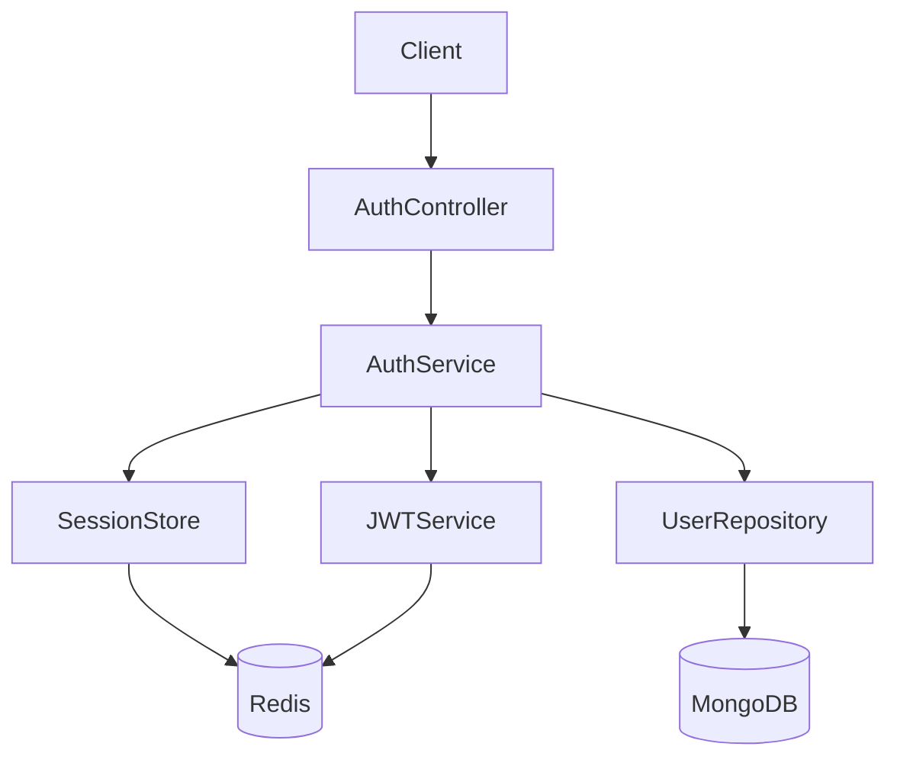
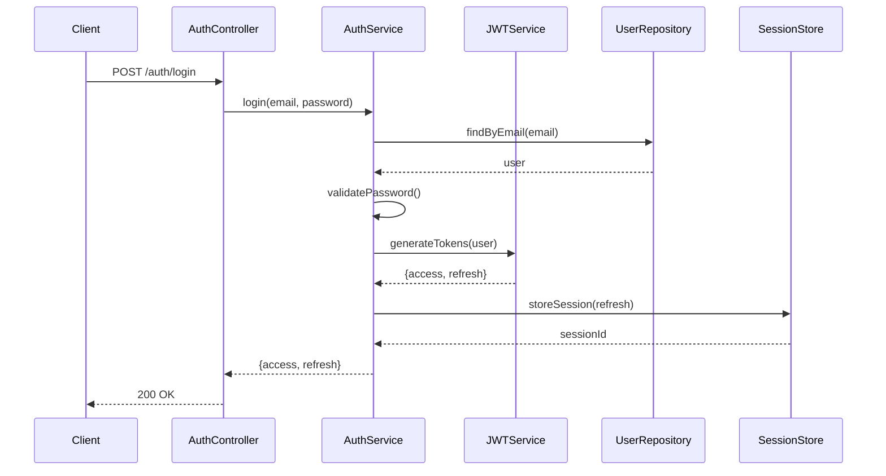

# Authentication

---

## Business Problem

Why does this exist?

Enterprise teams need secure, scalable authentication supporting multiple identity providers, role-based access control, and session management across web and mobile clients.

---

## Requirements

### Functional

- User registration with email/password
- OAuth2 login (Google, GitHub, Microsoft)
- Multi-factor authentication (TOTP)
- Role-based access control (RBAC)
- Session management with refresh tokens
- Password reset flow
- Email verification

### Non-Functional

- Token expiration: Access 15min, Refresh 7 days
- Password hashing: bcrypt cost factor 12
- Rate limiting: 5 login attempts per 15 min
- Response time: <200ms for token validation
- Support 10k concurrent sessions

---

## High Level Architecture



---

## Data Flow



---

## Database

### Collections

**users**
```javascript
{
  _id: ObjectId,
  email: String,              // unique, indexed
  passwordHash: String,
  roles: [String],            // ['admin', 'member']
  orgId: ObjectId,            // indexed
  mfaEnabled: Boolean,
  mfaSecret: String,
  emailVerified: Boolean,
  createdAt: Date,
  updatedAt: Date
}
```

**sessions** (Redis)
```javascript
{
  sessionId: String,          // key
  userId: String,
  refreshToken: String,
  expiresAt: Date,
  metadata: {
    ip: String,
    userAgent: String
  }
}
```

### Indexes

- `users.email` — unique index
- `users.orgId` — query by organization
- `users.createdAt` — sorting and analytics

---

## API Design

### Endpoints

| Method | Path | Description |
|--------|------|-------------|
| POST | `/api/auth/register` | Register new user |
| POST | `/api/auth/login` | Login with credentials |
| POST | `/api/auth/logout` | Logout and invalidate session |
| POST | `/api/auth/refresh` | Refresh access token |
| POST | `/api/auth/forgot-password` | Initiate password reset |
| POST | `/api/auth/reset-password` | Complete password reset |
| POST | `/api/auth/verify-email` | Verify email address |
| POST | `/api/auth/mfa/enable` | Enable MFA |
| POST | `/api/auth/mfa/verify` | Verify MFA token |

### DTOs

**LoginRequest**
```typescript
{
  email: string;
  password: string;
  mfaToken?: string;
}
```

**LoginResponse**
```typescript
{
  accessToken: string;
  refreshToken: string;
  user: {
    id: string;
    email: string;
    roles: string[];
  };
}
```

**RegisterRequest**
```typescript
{
  email: string;
  password: string;
  name: string;
  orgId?: string;
}
```

---

## Frontend

### Component Hierarchy

```
AuthProvider
├── LoginPage
│   ├── LoginForm
│   └── OAuthButtons
├── RegisterPage
│   └── RegisterForm
├── ForgotPasswordPage
├── ResetPasswordPage
└── MFASetupPage
```

### State

```typescript
interface AuthState {
  user: User | null;
  accessToken: string | null;
  isAuthenticated: boolean;
  loading: boolean;
  error: string | null;
}
```

### Cache

- Access token: localStorage (or memory only for high security)
- Refresh token: httpOnly cookie
- User profile: React Query cache (5 min stale time)

---

## Backend

### Modules

```
auth/
├── auth.controller.ts
├── auth.service.ts
├── auth.module.ts
├── guards/
│   ├── jwt-auth.guard.ts
│   └── roles.guard.ts
├── strategies/
│   ├── jwt.strategy.ts
│   └── oauth.strategy.ts
└── dto/
    ├── login.dto.ts
    └── register.dto.ts
```

### Services

**AuthService**
- `register(dto: RegisterDto): Promise<User>`
- `login(dto: LoginDto): Promise<AuthResponse>`
- `logout(sessionId: string): Promise<void>`
- `refreshTokens(token: string): Promise<AuthResponse>`
- `validateUser(email, password): Promise<User>`

**JWTService**
- `generateAccessToken(user: User): string`
- `generateRefreshToken(user: User): string`
- `verifyToken(token: string): Payload`

**SessionService**
- `createSession(userId, refreshToken): Promise<string>`
- `getSession(sessionId): Promise<Session>`
- `invalidateSession(sessionId): Promise<void>`

### Guards

**JwtAuthGuard** — Validates JWT on protected routes  
**RolesGuard** — Checks user roles against required roles

### Events

- `UserRegistered` — Trigger welcome email
- `UserLoggedIn` — Audit log
- `PasswordResetRequested` — Send reset email
- `MFAEnabled` — Audit log

---

## Security

### Threats

1. **Brute Force** — Attacker tries many passwords
2. **Token Theft** — XSS or MITM steals JWT
3. **Session Fixation** — Attacker sets session ID
4. **Credential Stuffing** — Reused passwords from breaches

### Mitigation

1. **Rate Limiting** — 5 attempts per 15 min per IP
2. **httpOnly Cookies** — Refresh token not accessible to JS
3. **Secure Headers** — HSTS, CSP, X-Frame-Options
4. **Short Token Lifetime** — Access token 15 min
5. **HTTPS Only** — All auth endpoints require TLS
6. **Password Strength** — Min 8 chars, uppercase, number, special
7. **MFA** — Optional TOTP for high-value accounts

---

## Scaling

### 100 users

- Single Node.js instance
- MongoDB Atlas Shared (M0)
- Redis Cloud Free Tier
- Response time: <50ms

### 10k users

- 3 Node.js instances (load balanced)
- MongoDB Atlas M10 (replica set)
- Redis Cluster (2 nodes)
- Session store sharded by userId
- Response time: <100ms

### 1M users

- Auto-scaling ECS (10-50 tasks)
- MongoDB Atlas M40 (sharded cluster)
- ElastiCache Redis (cluster mode)
- CloudFront for static assets
- Multi-region deployment
- Response time: <150ms

---

## Failure Scenarios

### Redis down

- **Impact**: No new sessions, token refresh fails
- **Mitigation**: 
  - Health check endpoint returns degraded
  - Fall back to stateless JWT validation only
  - Auto-restart Redis container
  - Alert on-call engineer

### Mongo down

- **Impact**: Cannot validate users, registration fails
- **Mitigation**:
  - MongoDB replica set auto-failover
  - Read from secondary if primary down
  - Circuit breaker pattern (fail fast)
  - Alert on-call engineer

### Token expired

- **Impact**: User sees 401, forced to re-login
- **Mitigation**:
  - Frontend auto-refresh using refresh token
  - Retry failed request after refresh
  - Silent refresh in background before expiry

---

## Monitoring

### Logs

```json
{
  "event": "login_success",
  "userId": "123",
  "ip": "192.168.1.1",
  "timestamp": "2026-08-06T10:30:00Z"
}
```

```json
{
  "event": "login_failed",
  "email": "user@example.com",
  "reason": "invalid_password",
  "ip": "192.168.1.1"
}
```

### Metrics

- `auth.login.success` — Counter
- `auth.login.failed` — Counter (by reason)
- `auth.token.issued` — Counter
- `auth.response_time` — Histogram (p50, p95, p99)
- `auth.active_sessions` — Gauge

### Tracing

- Span: `POST /auth/login`
  - Child: `validateUser`
  - Child: `generateTokens`
  - Child: `storeSession`

---

## Tradeoffs

### Alternative A: Session-Based Auth (Cookies)

**Pros**: Simple, server controls revocation  
**Cons**: Requires sticky sessions or shared store, not stateless

### Alternative B: JWT-Only (No Refresh Token)

**Pros**: Completely stateless, no Redis needed  
**Cons**: Cannot revoke tokens, long expiry = security risk

### Why This One? (JWT + Refresh Token)

**Pros**: 
- Stateless access tokens (fast validation)
- Revocable via refresh token invalidation
- Scales horizontally without sticky sessions

**Cons**:
- Requires Redis for session store
- More complex than pure JWT

**Decision**: Best balance of security, scalability, and user experience.
