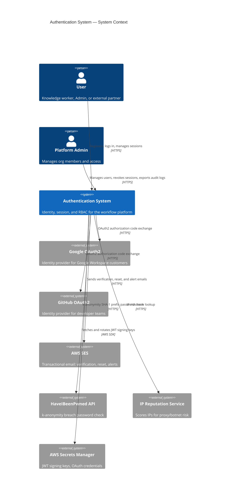
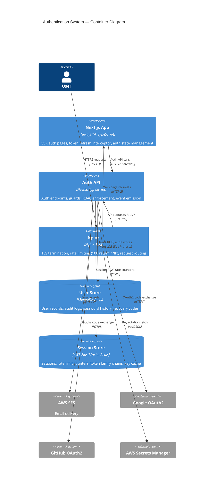
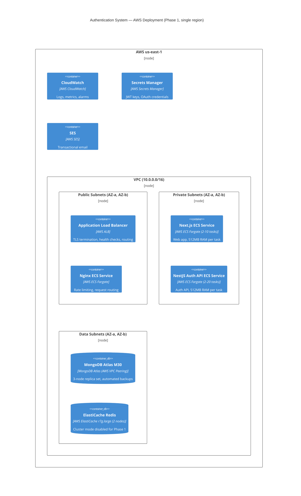
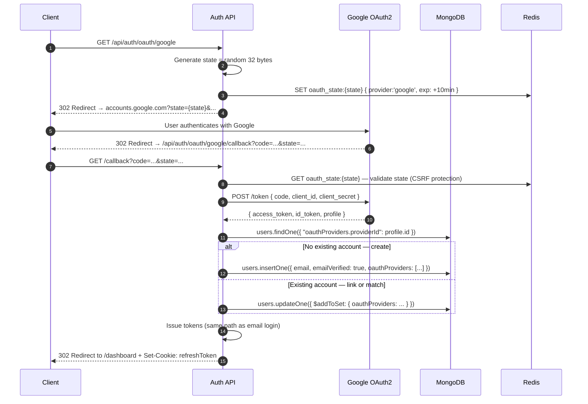

# Authentication System Architecture

**Document Status**: Active  
**Last Updated**: 2026-08-06  
**Author**: Principal Architect  
**Audience**: Engineering Team, Security Team, Platform Team

---

## Table of Contents

1. [Architecture Overview](#1-architecture-overview)
2. [High-Level Architecture](#2-high-level-architecture)
3. [Frontend Architecture](#3-frontend-architecture)
4. [Backend Architecture](#4-backend-architecture)
5. [Database Design](#5-database-design)
6. [API Design](#6-api-design)
7. [Authentication Flow](#7-authentication-flow)
8. [Token Lifecycle](#8-token-lifecycle)
9. [Session Management](#9-session-management)
10. [Caching Strategy](#10-caching-strategy)
11. [Scaling Strategy](#11-scaling-strategy)
12. [Failure Scenarios](#12-failure-scenarios)
13. [Monitoring](#13-monitoring)
14. [Security](#14-security)
15. [Tradeoffs](#15-tradeoffs)

---

## 1. Architecture Overview

### 1.1 Purpose

This document defines the architecture for the Authentication System of an enterprise workflow platform. The system supports 1,000 to 1,000,000 users, enforces zero-trust security, and provides the identity foundation for all platform features.

### 1.2 Architectural Principles

**Why these principles?**

1. **Defense in Depth** — Security through multiple independent layers, not a single control
2. **Stateless Horizontal Scaling** — Any instance handles any request without shared memory
3. **Fail Secure** — Authentication failures return 401/403, never silently grant access
4. **Observable by Default** — All auth events logged, traced, and metered
5. **Graceful Degradation** — Partial failures downgrade features, never crash the system

### 1.3 Technology Decisions Summary

| Concern | Choice | Why |
|---|---|---|
| Access token | JWT (HS256) | Stateless validation, <200ms p99 |
| Refresh token | Opaque token in httpOnly cookie | Cannot be stolen via XSS |
| Session store | Redis ElastiCache | Sub-millisecond lookup, TTL support |
| User store | MongoDB Atlas | Flexible schema, horizontal sharding |
| Password hashing | bcrypt cost 12 | Resistant to GPU brute-force |
| Key storage | AWS Secrets Manager | Rotation without deployment |
| Frontend | Next.js 14 App Router | SSR for auth pages, no token in URL |
| Backend | NestJS | Decorator-based guards, modular DI |
| Rate limiting | Redis counters + Nginx | Shared state across instances |

---

## 2. High-Level Architecture

### 2.1 System Context Diagram

WHY: The context diagram shows WHO talks to the auth system and WHAT they get back. It forces us to enumerate every external actor before designing internals.



### 2.2 Container Diagram

WHY: Containers show how the system is physically deployed and what technology each piece uses. This is where infrastructure, network boundaries, and deployment units become concrete.




### 2.3 Deployment Diagram

WHY: The deployment diagram answers the ops team's question: "where does this run and how does it survive failures?" It also drives cost estimates and SLA definitions.



---

## 3. Frontend Architecture

### 3.1 Why Next.js App Router for Auth?

The browser is the most hostile environment for secret management. Every framework decision here is driven by one question: **where can an attacker steal tokens?**

- **Server Components for auth pages** — HTML is rendered server-side; no token values in JS bundles
- **No Access_Token in localStorage** — XSS can exfiltrate anything in localStorage; we keep the access token in memory (React state / Zustand)
- **Refresh_Token in httpOnly cookie** — JavaScript cannot read it; the browser sends it automatically on `/api/auth/refresh`
- **Next.js middleware for route protection** — Auth checks happen at the edge before a page renders, eliminating flash-of-unauthenticated-content

### 3.2 Component Architecture

```
app/
├── (auth)/                     # Route group — no layout header/nav
│   ├── login/page.tsx          # Server Component shell
│   ├── register/page.tsx
│   ├── forgot-password/page.tsx
│   ├── reset-password/page.tsx
│   └── verify-email/page.tsx
├── (protected)/                # Route group — requires auth
│   └── dashboard/page.tsx
├── middleware.ts               # Edge auth check — redirect unauthenticated users
└── providers.tsx               # AuthProvider wraps the app
```

### 3.3 Auth State (Zustand)

WHY Zustand over React Context: Context re-renders the entire tree on any auth state change (login, token refresh). Zustand's selector model means only components that read a specific slice re-render.

```typescript
// WHY: Access_Token in memory only — no XSS risk, no localStorage persistence
// WHY: isAuthenticated derived from token presence — single source of truth
interface AuthStore {
  user: User | null;
  accessToken: string | null;          // memory only — never persisted
  isAuthenticated: boolean;
  isLoading: boolean;
  
  login: (credentials: LoginDTO) => Promise<void>;
  logout: () => Promise<void>;
  refreshToken: () => Promise<string>;  // returns new access token
  clearAuth: () => void;
}
```

### 3.4 Silent Token Refresh Strategy

WHY: 15-minute Access_Token lifetime means frequent refresh. The user must never see a login prompt mid-task because of an expired token.

```
┌─────────────────────────────────────────────────────────────┐
│                    Token Refresh Strategy                    │
│                                                             │
│  Access Token: 15 min lifetime                              │
│  ├── t=0       Token issued                                 │
│  ├── t=13:00   Proactive refresh triggered (2 min before)   │
│  ├── t=14:30   Request interceptor detects near-expiry      │
│  │             → queues all concurrent requests             │
│  │             → fires single refresh                       │
│  │             → drains queue with new token                │
│  └── t=15:00   Token hard-expires                           │
│                                                             │
│  Axios interceptor pattern:                                 │
│  1. Check exp claim before every request                    │
│  2. If exp < now + 60s → refresh first, then continue      │
│  3. If 401 received → attempt one refresh, replay request  │
│  4. If refresh fails → clear auth, redirect to /login      │
└─────────────────────────────────────────────────────────────┘
```

### 3.5 Next.js Middleware (Edge Route Protection)

WHY middleware at the edge: Route protection that runs on the server-side in 0ms (no cold start) before any page renders. Alternative — client-side redirect in useEffect — causes flash of protected content.

```typescript
// middleware.ts runs on Vercel Edge / CloudFront Functions
// WHY: Validates JWT at edge — no round-trip to origin for simple auth checks
// WHY: Does NOT validate against Redis — stateless check only at edge
//      Full session validation happens at the API layer on data mutations
export function middleware(request: NextRequest) {
  const token = request.cookies.get('accessToken')?.value; // short-lived; edge-readable
  
  if (!token || isTokenExpired(token)) {
    return NextResponse.redirect(new URL('/login', request.url));
  }
  
  return NextResponse.next();
}
```


---

## 4. Backend Architecture

### 4.1 Why NestJS?

NestJS brings three things that matter for an auth system at scale:

1. **Decorator-based Guards** — `@UseGuards(JwtAuthGuard, RolesGuard)` composes security checks declaratively; the controller expresses intent, not implementation
2. **Dependency Injection** — `AuthService` gets `UserRepository`, `SessionService`, `JwtService` injected; every dependency is mockable in unit tests
3. **Module boundary enforcement** — `AuthModule` exports only `JwtAuthGuard`; internal services are invisible to the rest of the app

### 4.2 Module Structure

```
src/
├── auth/
│   ├── auth.module.ts                  # Wires all providers together
│   ├── auth.controller.ts              # HTTP boundary — DTOs in, responses out
│   ├── auth.service.ts                 # Orchestrates: validates, issues tokens, emits events
│   ├── guards/
│   │   ├── jwt-auth.guard.ts           # Validates Access_Token on protected routes
│   │   ├── roles.guard.ts              # Checks user.roles against @Roles() decorator
│   │   └── session.guard.ts            # Validates Refresh_Token + Redis session
│   ├── strategies/
│   │   ├── jwt.strategy.ts             # Passport JWT — extracts and validates JWT
│   │   ├── google-oauth.strategy.ts    # Passport OAuth2 — Google flow
│   │   └── github-oauth.strategy.ts    # Passport OAuth2 — GitHub flow
│   ├── services/
│   │   ├── token.service.ts            # JWT generation, verification, key rotation
│   │   ├── session.service.ts          # Redis session CRUD, family chain management
│   │   ├── mfa.service.ts              # TOTP generation, verification, recovery codes
│   │   ├── password.service.ts         # bcrypt hashing, history, breach check
│   │   └── rate-limit.service.ts       # Per-IP and per-account Redis counters
│   ├── events/
│   │   └── auth.events.ts              # Event types emitted to EventEmitter2
│   └── dto/
│       ├── login.dto.ts
│       ├── register.dto.ts
│       └── refresh.dto.ts
├── users/
│   ├── user.schema.ts                  # Mongoose schema
│   └── user.repository.ts             # Data access — no business logic here
└── common/
    ├── decorators/
    │   └── roles.decorator.ts          # @Roles('admin') metadata
    └── interceptors/
        └── audit-log.interceptor.ts    # Appends audit entry for every auth event
```

### 4.3 Request Lifecycle (Protected Endpoint)

```
HTTP Request
    │
    ▼
Nginx (rate limit: 100/min/IP)
    │
    ▼
NestJS Global Pipes (validation, sanitization)
    │
    ▼
JwtAuthGuard
  ├── Extract Bearer token from Authorization header
  ├── Verify JWT signature (from memory-cached signing key)
  ├── Check exp claim
  └── Attach user payload to request
    │
    ▼
RolesGuard
  ├── Read @Roles() metadata from route handler
  └── Check request.user.roles contains required role
    │
    ▼
Controller → Service → Repository
    │
    ▼
AuditLogInterceptor (post-response: write audit entry)
```

### 4.4 Key Service Contracts

**TokenService**
```
generateAccessToken(user, keyVersion) → JWT
generateRefreshToken()               → opaque 256-bit random string
verifyAccessToken(token)             → Payload | throw
getSigningKey(kid)                   → key (from memory cache)
rotateSigningKey()                   → void (fetch new key, update cache)
```

**SessionService**
```
createSession(userId, refreshToken, fingerprint, ip, ua) → sessionId
getSession(sessionId)                                    → Session | null
rotateRefreshToken(sessionId, newRefreshToken)           → void
detectTokenReuse(tokenFamilyId, tokenVersion)            → boolean
invalidateSession(sessionId)                             → void
invalidateAllUserSessions(userId)                        → void
invalidateOrgSessions(orgId)                             → void
```

**PasswordService**
```
hash(plaintext)                   → hash
verify(plaintext, hash)           → boolean
checkHistory(plaintext, hashes[]) → boolean (true = reused)
checkPwnedPassword(plaintext)     → boolean (true = breached)
```


---

## 5. Database Design

### 5.1 Why MongoDB for User Storage?

The user schema evolves rapidly in early product phases: OAuth provider links, MFA config, org-level password policy fields. MongoDB's document model avoids schema migrations that would require locking the `users` collection.

However: MongoDB is NOT used for the session store (that's Redis). Session lookup must be sub-millisecond. MongoDB at p99 under load is 5-20ms — too slow to add to every protected request.

### 5.2 Collections

#### `users`

```javascript
{
  _id:                  ObjectId,
  email:                String,          // unique, indexed — primary identifier
  passwordHash:         String | null,   // null for pure OAuth users
  passwordHistory:      [String],        // last 5 bcrypt hashes — breach window minimization
  passwordLastChangedAt: Date,
  
  roles:                [String],        // ['admin', 'member'] — array enables future multi-role
  orgId:                ObjectId,        // indexed — tenant isolation
  
  emailVerified:        Boolean,
  deactivatedAt:        Date | null,     // soft delete — preserves audit trail
  
  mfaEnabled:           Boolean,
  mfaSecret:            String | null,   // AES-256 encrypted at rest
  recoveryCodes:        [{
    hash:       String,                  // bcrypt hash — never store plaintext codes
    usedAt:     Date | null
  }],
  
  oauthProviders:       [{
    provider:   String,                  // 'google' | 'github'
    providerId: String,                  // provider's unique user ID
    linkedAt:   Date
  }],
  
  deviceFingerprints:   [{               // last 90 days — for suspicious login detection
    fingerprint:   String,
    country:       String,
    lastSeenAt:    Date
  }],
  
  createdAt:            Date,
  updatedAt:            Date
}
```

**Indexes:**
```javascript
{ email: 1 }             // unique — login lookup
{ orgId: 1 }             // org-scoped queries (admin user list)
{ "oauthProviders.provider": 1, "oauthProviders.providerId": 1 }  // OAuth upsert
```

#### `audit_logs`

WHY a separate collection: The audit log is append-only. It must never be in the same collection as mutable user data. A single misconfigured update could silently corrupt user records and audit entries simultaneously. Separation provides write isolation and makes the append-only invariant easy to enforce at the MongoDB level (insert-only role).

```javascript
{
  _id:           ObjectId,
  eventType:     String,         // 'login_success' | 'login_failed' | 'mfa_enabled' | ...
  timestamp:     Date,           // UTC, millisecond precision — indexed
  userId:        ObjectId | null,
  email:         String | null,  // for pre-authentication events where userId unknown
  orgId:         ObjectId | null,
  ip:            String,
  userAgent:     String,
  outcome:       String,         // 'success' | 'failure'
  metadata:      Object,         // event-specific payload (e.g., { reason: 'rate_limited' })
  correlationId: String          // traces to originating HTTP request ID
}
```

**Indexes:**
```javascript
{ timestamp: -1 }               // time-range audit queries
{ userId: 1, timestamp: -1 }    // user-specific audit export
{ orgId: 1, timestamp: -1 }     // org-level compliance export
```

**TTL Index (365 days):**
```javascript
{ timestamp: 1 }, { expireAfterSeconds: 31536000 }
```

#### `password_reset_tokens` / `email_verification_tokens`

WHY separate collections: Keeps short-lived operational tokens out of the user document. Simplifies TTL management — a TTL index on a small collection is cheaper than scanning a large `users` collection.

```javascript
{
  _id:       ObjectId,
  userId:    ObjectId,           // indexed
  token:     String,             // SHA-256 hash of the actual token (never store plaintext)
  expiresAt: Date,               // TTL index
  usedAt:    Date | null,        // single-use enforcement
  createdAt: Date
}
```

### 5.3 Redis Data Structures

WHY explicit data structure design for Redis: Redis is schema-less. Without documented structure, developers invent inconsistent key formats that break sharding and TTL strategies.

```
# Session record (HASH)
Key:   session:{sessionId}
TTL:   7 days
Fields:
  userId        → string
  refreshToken  → SHA-256(refreshToken)   # hash only — never store raw token
  familyId      → string                  # Token_Family root ID
  familyVersion → integer                 # increments on each rotation
  ip            → string
  userAgent     → string
  fingerprint   → string
  createdAt     → ISO timestamp
  lastUsedAt    → ISO timestamp

# User's session index (SET)
Key:   user_sessions:{userId}
TTL:   none (managed by session creation/deletion)
Value: set of sessionIds

# Org's session index (SET)  
Key:   org_sessions:{orgId}
TTL:   none
Value: set of sessionIds

# Token family chain (HASH) — for reuse detection
Key:   token_family:{familyId}
TTL:   7 days
Fields:
  currentVersion → integer
  invalidated    → boolean

# Per-account login failure counter (STRING)
Key:   login_fail_account:{email}
TTL:   15 minutes (sliding)
Value: integer (count)

# Per-IP login failure counter (STRING)
Key:   login_fail_ip:{ip}
TTL:   15 minutes (sliding)
Value: integer (count)

# Per-IP credential stuffing counter (STRING)
Key:   login_stuffing_ip:{ip}
TTL:   5 minutes
Value: integer (distinct email count)

# JWT signing key cache (HASH)
Key:   jwt_keys
TTL:   5 minutes
Fields:
  {kid} → signing key
```


---

## 6. API Design

### 6.1 Endpoint Reference

| Method | Path | Auth | Description |
|---|---|---|---|
| POST | `/api/auth/register` | None | Create account |
| POST | `/api/auth/login` | None | Email + password login |
| POST | `/api/auth/logout` | JWT | Terminate session |
| POST | `/api/auth/logout-all` | JWT | Terminate all sessions |
| POST | `/api/auth/refresh` | Cookie | Rotate refresh token |
| POST | `/api/auth/forgot-password` | None | Send reset email |
| POST | `/api/auth/reset-password` | None | Complete reset |
| POST | `/api/auth/verify-email` | None | Verify email token |
| POST | `/api/auth/verify-email/resend` | None | Resend verification |
| GET  | `/api/auth/oauth/google` | None | Initiate Google OAuth |
| GET  | `/api/auth/oauth/google/callback` | None | Google OAuth callback |
| GET  | `/api/auth/oauth/github` | None | Initiate GitHub OAuth |
| GET  | `/api/auth/oauth/github/callback` | None | GitHub OAuth callback |
| POST | `/api/auth/mfa/setup` | JWT | Generate TOTP secret + QR |
| POST | `/api/auth/mfa/confirm` | JWT | Activate MFA |
| POST | `/api/auth/mfa/verify` | Partial | Submit TOTP during login |
| POST | `/api/auth/mfa/disable` | JWT | Disable MFA |
| GET  | `/api/auth/mfa/recovery-codes` | JWT | View recovery codes |
| POST | `/api/auth/mfa/recovery-codes/regenerate` | JWT | Regenerate codes |
| GET  | `/api/auth/sessions` | JWT | List active sessions |
| DELETE | `/api/auth/sessions/:id` | JWT | Revoke specific session |
| DELETE | `/api/auth/sessions/revoke/:token` | None | One-click email revocation |
| GET  | `/api/auth/health` | None | Dependency health check |

### 6.2 Key Request/Response Shapes

**POST /api/auth/login**

Request:
```json
{ "email": "user@example.com", "password": "••••••••" }
```

Response (success, no MFA):
```json
{
  "accessToken": "eyJ...",
  "user": { "id": "...", "email": "...", "roles": ["member"], "orgId": "..." }
}
```
+ `Set-Cookie: refreshToken=<opaque>; HttpOnly; Secure; SameSite=Strict; Max-Age=604800; Path=/api/auth/refresh`

Response (MFA required):
```json
{ "status": "MFA_REQUIRED", "mfaChallenge": "<short-lived challenge token>" }
```

WHY a separate `mfaChallenge` token: It proves the user passed password verification without issuing a full Access_Token. The challenge token is stored in Redis with a 5-minute TTL, scoped only to the MFA verify endpoint.

**POST /api/auth/refresh**

Request: no body — Refresh_Token is in the httpOnly cookie  
Response: `{ "accessToken": "eyJ..." }`  
+ rotated Refresh_Token in `Set-Cookie`

WHY no body on refresh: The Refresh_Token must never appear in request/response bodies that could be logged by proxies, CDNs, or application-layer middleware.

**Error Response Shape (all endpoints)**

```json
{
  "statusCode": 401,
  "error": "INVALID_CREDENTIALS",
  "message": "The email or password is incorrect.",
  "correlationId": "req_abc123"
}
```

WHY `correlationId`: Lets support teams trace an error in CloudWatch Logs from a user-reported incident without exposing internal stack traces.

---

## 7. Authentication Flow

### 7.1 Email + Password Login with MFA

```mermaid
sequenceDiagram
    autonumber
    participant C as Client (Browser)
    participant N as Next.js
    participant API as Auth API (NestJS)
    participant R as Redis
    participant M as MongoDB
    participant HIBP as HaveIBeenPwned
    participant SES as AWS SES

    C->>N: POST /api/auth/login { email, password }
    N->>API: Forward request
    
    API->>R: GET login_fail_account:{email} — check account throttle
    R-->>API: count (e.g. 2)
    API->>R: GET login_fail_ip:{ip} — check IP throttle
    R-->>API: count (e.g. 1)
    
    API->>M: users.findOne({ email })
    M-->>API: user document (or null)
    
    alt User not found
        API->>R: INCR login_fail_account:{email}, INCR login_fail_ip:{ip}
        API-->>C: 401 INVALID_CREDENTIALS
    end
    
    API->>API: bcrypt.compare(password, user.passwordHash)
    
    alt Password incorrect
        API->>R: INCR login_fail_account:{email}, INCR login_fail_ip:{ip}
        API-->>C: 401 INVALID_CREDENTIALS
    end
    
    alt MFA enabled
        API->>R: SET mfa_challenge:{challengeId} { userId, exp: +5min }
        API-->>C: 200 MFA_REQUIRED { mfaChallenge: challengeId }
        C->>API: POST /api/auth/mfa/verify { challengeId, totpToken }
        API->>R: GET mfa_challenge:{challengeId}
        API->>API: TOTP.verify(token, user.mfaSecret, ±30s tolerance)
        alt TOTP invalid
            API->>R: INCR mfa_fail:{userId}
            API-->>C: 401 INVALID_MFA_TOKEN
        end
    end
    
    API->>API: Compute Device_Fingerprint from UA + Accept-Language
    API->>API: Check fingerprint vs user.deviceFingerprints (90-day window)
    
    alt Suspicious login
        API->>SES: Send security alert email (async, non-blocking)
    end
    
    API->>API: generateRefreshToken() → 256-bit random
    API->>API: generateAccessToken(user, kid) → JWT
    API->>R: HSET session:{sessionId} { userId, refreshToken: SHA256(rt), familyId, familyVersion:1, ... }
    API->>R: SADD user_sessions:{userId} sessionId
    API->>R: DEL login_fail_account:{email}, login_fail_ip:{ip}
    
    API->>M: audit_logs.insertOne({ eventType: 'login_success', ... })
    
    API-->>C: 200 { accessToken } + Set-Cookie: refreshToken=...; HttpOnly
```

### 7.2 OAuth2 Login (Google)




---

## 8. Token Lifecycle

### 8.1 Access Token (JWT)

**Lifetime**: 15 minutes  
**Storage**: Memory (React state) on client  
**Why 15 minutes?** Balances UX (user not forced to re-login constantly) against blast radius (stolen token has narrow validity window).

**JWT Structure (HS256)**

Header:
```json
{ "alg": "HS256", "typ": "JWT", "kid": "v2" }
```

Payload:
```json
{
  "sub": "userId",
  "email": "user@example.com",
  "roles": ["member"],
  "orgId": "orgId",
  "iat": 1691337600,
  "exp": 1691338500
}
```

WHY `kid` in header: Enables zero-downtime key rotation. When a new signing key is added to AWS Secrets Manager, old tokens signed with `kid: v1` continue to validate for 15 minutes while new tokens use `kid: v2`.

### 8.2 Refresh Token

**Lifetime**: 7 days  
**Storage**: httpOnly cookie (client), Redis (server)  
**Why 7 days?** Enterprise users expect "remember me" behavior. Re-login every hour destroys productivity. At 7 days, a stolen Refresh_Token has maximum 7-day exposure if the session store is not checked.

**Token Format**: Opaque 256-bit random string (not JWT)  
WHY opaque: The Refresh_Token must not carry claims. It's a session ID. Storing claims in the Refresh_Token would create two sources of truth (Redis session vs. token claims).

**Token Rotation**: Every refresh issues a new Refresh_Token and invalidates the old one. This is called **Refresh Token Rotation**, and it defeats the following attack:

1. Attacker steals Refresh_Token (e.g., from leaked DB backup)
2. Attacker uses stolen token → rotated to version 2
3. Legitimate user uses their copy of the token (now version 1) → **reuse detected** → entire family invalidated
4. Both attacker and user are logged out
5. Audit log shows `RefreshTokenTheftDetected` event

### 8.3 Token Family Chain

A **Token Family** is the lineage of Refresh_Tokens descended from a single login event.

```
Login (t=0)
  └─ familyId: f123, version: 1
     └─ Refresh (t=10min) → new token, version: 2
        └─ Refresh (t=20min) → new token, version: 3
           └─ Refresh (t=30min) → new token, version: 4
```

If a token with `version: 2` is presented after `version: 3` was already issued → reuse detected → invalidate entire family.

---

## 9. Session Management

### 9.1 Session Data Model

```typescript
interface Session {
  sessionId:       string;       // primary key in Redis
  userId:          string;
  refreshToken:    string;       // SHA-256 hash only
  familyId:        string;       // Token_Family root
  familyVersion:   number;       // increments on rotation
  ip:              string;
  userAgent:       string;
  deviceFingerprint: string;
  country:         string;       // GeoIP lookup
  createdAt:       Date;
  lastUsedAt:      Date;
  expiresAt:       Date;         // 7 days from creation
}
```

### 9.2 Multi-Device Session Cap

WHY a session cap: Unlimited sessions enable an attacker with a stolen password to create hundreds of sessions that must all be checked on every RBAC update. The 10-session cap limits the blast radius of a compromised account.

**Policy**: Max 10 concurrent sessions per user. When an 11th session is created:
1. Query `user_sessions:{userId}` → list of sessionIds
2. For each sessionId, HGET `lastUsedAt`
3. Sort by `lastUsedAt` ascending
4. Delete oldest session: DEL `session:{oldestId}`, SREM `user_sessions:{userId}` oldestId

### 9.3 Session Revocation

**Single session revocation** (user action or admin action):
```redis
DEL session:{sessionId}
SREM user_sessions:{userId} sessionId
```

**All user sessions** (password reset, MFA disable, admin deactivation):
```redis
SMEMBERS user_sessions:{userId} → [s1, s2, s3]
DEL session:s1 session:s2 session:s3
DEL user_sessions:{userId}
```

**All org sessions** (org deletion, security incident):
```redis
SMEMBERS org_sessions:{orgId} → [s1, s2, ..., sN]
DEL session:s1 ... session:sN
DEL org_sessions:{orgId}
```

### 9.4 Suspicious Login Downgrade

WHY downgrade instead of block: False positives (legitimate user in new location) would lock the user out. Downgrade lets them access the platform read-only while the system waits for email confirmation.

When a Suspicious_Login is detected:
```redis
HSET session:{sessionId} trustLevel 'read_only'
```

The `RolesGuard` reads `trustLevel` and blocks write operations until the user clicks the "This was me" link in the alert email, which sets `trustLevel` back to `full`.

---

## 10. Caching Strategy

### 10.1 JWT Signing Key Cache

WHY cache signing keys: Every Access_Token validation checks the signature. Fetching the signing key from AWS Secrets Manager adds 50-100ms latency. At 1000 req/s, that's $10/hr in Secrets Manager API costs.

```
┌─────────────────────────────────────────────────────┐
│         JWT Signing Key Cache Strategy              │
│                                                     │
│  Location: Redis HASH jwt_keys                     │
│  TTL: 5 minutes                                     │
│                                                     │
│  Cache miss flow:                                   │
│  1. Client sends JWT with kid: v2                  │
│  2. Server checks Redis: HGET jwt_keys v2          │
│  3. If null:                                        │
│     a. Fetch from AWS Secrets Manager               │
│     b. HSET jwt_keys v2 {key}                       │
│     c. EXPIRE jwt_keys 300                          │
│  4. Validate JWT signature with cached key         │
│                                                     │
│  Key rotation without downtime:                     │
│  - Add v3 to Secrets Manager                        │
│  - New tokens use v3                                │
│  - Old tokens (v2) still valid for 15 min          │
│  - After 15 min, retire v2                          │
└─────────────────────────────────────────────────────┘
```

### 10.2 User Profile Cache

WHY cache user profile: Every protected request validates the JWT and attaches `request.user`. If `request.user` only contains `userId`, the next service layer needs to fetch `user.roles`, `user.orgId`, etc. from MongoDB. Caching the profile in Redis avoids this.

**Cache key**: `user_profile:{userId}`  
**TTL**: 5 minutes  
**Invalidation**: On role change, password reset, MFA enable/disable → DEL `user_profile:{userId}`

### 10.3 Rate Limit Counters

WHY counters in Redis (not in-memory): The rate limiter must enforce limits across all API instances. In-memory counters would let an attacker rotate requests across instances to bypass the limit.

**Per-IP counter**: `login_fail_ip:{ip}` → STRING, TTL 15 minutes  
**Per-account counter**: `login_fail_account:{email}` → STRING, TTL 15 minutes  
**Credential stuffing counter**: `login_stuffing_ip:{ip}` → STRING, TTL 5 minutes


---

## 11. Scaling Strategy

### 11.1 Scale Tiers

| Tier | Users | ECS Tasks | MongoDB | Redis | Expected p95 |
|---|---|---|---|---|---|
| Phase 1 | 1K–10K | 2 NestJS, 2 Next.js | Atlas M10 (replica set) | ElastiCache r7g.large (2 nodes) | <100ms |
| Phase 2 | 10K–100K | 4–10 NestJS auto-scale | Atlas M30 (replica set) | ElastiCache r7g.xlarge (3 nodes) | <150ms |
| Phase 3 | 100K–500K | 10–30 NestJS auto-scale | Atlas M50 (sharded 2-shard) | ElastiCache cluster mode (6 nodes) | <200ms |
| Phase 4 | 500K–1M | 20–50 NestJS auto-scale | Atlas M80 (sharded 4-shard) | ElastiCache cluster mode (12 nodes) | <200ms |

### 11.2 Stateless Design (Why It Matters)

The NestJS Auth API holds zero in-process state:
- No session data in memory (all in Redis)
- No user data in memory (fetched from MongoDB / Redis cache per request)
- No signing key in memory beyond 5-minute cache

This means the ALB health check is the only signal needed to add or remove tasks. No session affinity. No drain required beyond the 15-second deregistration delay.

### 11.3 Redis Scaling Path

Phase 1: Single primary + 1 replica. Reads from replica for profile cache; writes to primary for session mutations.

Phase 3: Redis Cluster mode enabled. Key distribution strategy:
- `session:{sessionId}` → hash slot on sessionId
- `user_sessions:{userId}` → same hash tag `{userId}` ensures all a user's sessions land on the same shard

WHY same shard for user sessions: The `invalidateAllUserSessions` operation requires reading `user_sessions:{userId}` and deleting all listed sessions atomically. Cross-shard operations in Redis Cluster cannot use multi-key commands.

### 11.4 MongoDB Scaling Path

The `users` collection indexes support all auth queries at scale:
- Login: `{ email: 1 }` — O(log n) lookup, fast even at 1M users
- Org admin queries: `{ orgId: 1 }` — bounded by org size, not total users
- OAuth upsert: compound index on `oauthProviders`

At Phase 4 (500K+ users), shard key is `{ orgId: "hashed" }`. WHY: Distributes data by organization (tenant), keeping all data for one org on one shard (important for compliance data residency) while spreading load across the cluster.

---

## 12. Failure Scenarios

### 12.1 Redis Unavailable

```
Impact:
  - Token refresh fails (cannot validate Refresh_Token)
  - New sessions cannot be created
  - Rate limit counters offline

Behavior:
  - Access_Token validation continues (stateless JWT — no Redis call)
  - Token refresh → HTTP 503 SESSION_STORE_UNAVAILABLE
  - Login → HTTP 503 SESSION_STORE_UNAVAILABLE
  - /health endpoint reports Redis: unhealthy

WHY not fall back to stateless-only for refresh:
  Without Redis we cannot detect token reuse or respect revocations.
  A stolen Refresh_Token would be unrevokable. Failing hard is correct.

Recovery:
  - ElastiCache automatic failover to replica (typically < 60 seconds)
  - Circuit breaker in NestJS stops hammering Redis during outage
  - CloudWatch alarm triggers on-call in < 2 minutes
```

### 12.2 MongoDB Unavailable

```
Impact:
  - Login blocked (cannot look up user)
  - Registration blocked
  - Audit log writes buffered

Behavior:
  - Access_Token validation continues (JWT stateless)
  - Login → HTTP 503 USER_STORE_UNAVAILABLE
  - Protected endpoints with valid JWT: continue serving (no user lookup needed)
  - Audit writes: queued in Redis list, flushed on recovery

WHY read from secondary on primary failure:
  MongoDB Atlas replica set auto-promotes secondary to primary within 10 seconds.
  Application MongoDB driver automatically follows the new primary.
  No code change needed — driver handles this.
```

### 12.3 Email Service Unavailable

```
Impact:
  - Verification emails not sent
  - Password reset emails not sent
  - Security alert emails delayed

Behavior:
  - API returns HTTP 202 (accepted, not guaranteed)
  - Email events queued in Redis list email_queue
  - Worker retries with backoff: 1min, 5min, 15min, 1hr
  - After 15min without delivery: /health reports email: degraded

WHY 202 not 500:
  The user successfully triggered the action. Blocking registration or
  reset because the email service is briefly unavailable is worse UX than
  a delayed email. The email WILL be delivered when SES recovers.
```

### 12.4 OAuth Provider Unavailable

```
Impact:
  - Google/GitHub login blocked
  - Email/password login unaffected

Behavior:
  - Circuit breaker opens after 5 consecutive failures in 30 seconds
  - Open circuit: immediately return OAUTH_PROVIDER_UNAVAILABLE (no timeout wait)
  - Frontend: display "Google login unavailable, use email/password"
  - Circuit probe: test every 60 seconds

WHY not retry indefinitely:
  Each failed OAuth attempt holds a connection for up to 10 seconds.
  Under load, this exhausts the connection pool and cascades to other failures.
```

### 12.5 JWT Signing Key Compromised

```
Incident response:
  1. Generate new key v3 in AWS Secrets Manager
  2. Deploy updated config (env var pointing to new secret name)
  3. All instances refresh key cache within 5 minutes (cache TTL)
  4. New tokens use kid:v3
  5. Retire kid:v2 — add to rejected_kids set in Redis
  6. Tokens with kid:v2 rejected immediately (regardless of exp)
  7. Affected users see 401 → frontend triggers refresh → new session

RTO: < 5 minutes (cache TTL-driven propagation)
RPO: 0 (no data loss — session store unaffected)
```

---

## 13. Monitoring

### 13.1 Key Metrics (CloudWatch)

| Metric | Type | Alarm Threshold | Action |
|---|---|---|---|
| `auth.login.success` | Counter | — | Baseline |
| `auth.login.failed` | Counter | > 1000/min | PagerDuty alert |
| `auth.token.issued` | Counter | — | Baseline |
| `auth.refresh.failed` | Counter | > 5% of refreshes | PagerDuty alert |
| `auth.response_time` | Histogram (p50/p95/p99) | p99 > 500ms | PagerDuty alert |
| `auth.rate_limit.triggered` | Counter | > 500/min | PagerDuty alert |
| `auth.credential_stuffing.detected` | Counter | > 0 | Immediate PagerDuty |
| `auth.token_theft.detected` | Counter | > 0 | Immediate PagerDuty |
| `auth.suspicious_login.detected` | Counter | — | Informational |
| `redis.session_store.healthy` | Gauge (0/1) | = 0 | Immediate PagerDuty |
| `mongo.user_store.healthy` | Gauge (0/1) | = 0 | Immediate PagerDuty |
| `auth.active_sessions` | Gauge | — | Capacity planning |

### 13.2 Distributed Tracing

Every auth request carries a `correlationId` (UUID v4) in the `X-Correlation-ID` header. Spans:

```
POST /api/auth/login
  ├── rate_limit_check          (Redis GET)
  ├── user_lookup               (MongoDB findOne)
  ├── password_verify           (bcrypt.compare)
  ├── mfa_verify                (TOTP.verify, if applicable)
  ├── suspicious_login_check    (fingerprint comparison)
  ├── session_create            (Redis HSET)
  └── audit_log_write           (MongoDB insertOne)
```

### 13.3 Structured Log Format

Every auth event written to CloudWatch Logs as structured JSON:

```json
{
  "level": "info",
  "event": "login_success",
  "correlationId": "req_01HXYZ",
  "userId": "6655...",
  "orgId": "4421...",
  "ip": "203.0.113.1",
  "country": "US",
  "userAgent": "Mozilla/5.0...",
  "mfaUsed": false,
  "suspicious": false,
  "durationMs": 312,
  "timestamp": "2026-08-06T14:22:00.123Z"
}
```

WHY structured JSON: CloudWatch Logs Insights can query across every field. A security engineer can find `filter event = 'login_failed' | stats count by ip` in seconds.

### 13.4 Health Endpoint Response

```json
{
  "status": "degraded",
  "dependencies": {
    "mongodb":       { "status": "healthy", "latencyMs": 4 },
    "redis":         { "status": "healthy", "latencyMs": 1 },
    "emailService":  { "status": "degraded", "queueDepth": 42, "oldestMessageAgeMin": 8 },
    "googleOAuth":   { "status": "healthy" },
    "githubOAuth":   { "status": "healthy" }
  }
}
```


---

## 14. Security

### 14.1 Threat Model

| Threat | Attack Vector | Control | Residual Risk |
|---|---|---|---|
| Credential brute force | Automated password guessing | Per-account throttle (5/15min), per-IP throttle, CAPTCHA for reputation-flagged IPs | Low |
| Credential stuffing | Breached credential list replay | Per-account throttle + HaveIBeenPwned check on login | Low |
| Token theft (Access) | XSS reading memory | Token in memory, 15-min lifetime — attacker has narrow window | Low |
| Token theft (Refresh) | Cookie theft, network sniff | httpOnly cookie (no JS read), HTTPS-only, SameSite=Strict | Low |
| Refresh token reuse | Stolen backup/leaked Redis | Token Family chain — reuse invalidates entire family | Low |
| CSRF on OAuth callback | Forged state parameter | State nonce stored in Redis, validated on callback | Low |
| Account takeover via email collision | Link Google account to existing account | Require explicit user consent before linking | Low |
| JWT algorithm confusion | Attacker sends `alg: none` | Explicit algorithm whitelist (HS256 only), reject `none` | Eliminated |
| Key compromise | Leaked JWT secret | Kid-versioned rotation, secret in Secrets Manager (never in env) | Low |
| Session fixation | Attacker sets session cookie | New sessionId generated on every login | Eliminated |
| Insider threat | Admin exports user data | Export requires admin role + is itself audit-logged | Low |
| GDPR data access | Data residency violation | Org-level regional enforcement at write path | Low |
| Last-admin lockout | Admin removes own role | Last-admin protection check before role mutation | Eliminated |

### 14.2 Cookie Security Configuration

```
Set-Cookie: refreshToken=<value>;
  HttpOnly;           // JavaScript cannot read — defeats XSS token theft
  Secure;             // HTTPS-only — defeats network sniffing
  SameSite=Strict;    // Not sent on cross-origin requests — defeats CSRF
  Max-Age=604800;     // 7 days TTL matches Redis session TTL
  Path=/api/auth/refresh;  // WHY path-scoped: cookie only sent on refresh endpoint
                            // Not on every API request — reduces exposure
```

WHY `Path=/api/auth/refresh` specifically: The Refresh_Token cookie should ONLY be sent to the one endpoint that validates it. If it were sent on every request, it would appear in more log entries, more network traces, and more CORS scenarios.

### 14.3 HTTP Security Headers

```
Strict-Transport-Security: max-age=31536000; includeSubDomains; preload
Content-Security-Policy: default-src 'self'; script-src 'self'; object-src 'none'
X-Frame-Options: DENY
X-Content-Type-Options: nosniff
Referrer-Policy: strict-origin-when-cross-origin
Permissions-Policy: camera=(), microphone=(), geolocation=()
```

### 14.4 Password Security

1. **Hashing**: bcrypt cost 12 — ~300ms to hash. Expensive for attackers, acceptable for users.
2. **Breach check**: HaveIBeenPwned k-anonymity — SHA-1(password) first 5 chars sent to API. Plaintext never leaves the server.
3. **History**: Last 5 hashes stored. Prevents rotation policy circumvention (user changing to last year's password).
4. **Minimum policy**: 8+ chars, 1 uppercase, 1 digit, 1 special character.

---

## 15. Tradeoffs

### 15.1 JWT vs. Opaque Access Tokens

| Factor | JWT | Opaque Token |
|---|---|---|
| Validation | Stateless — no Redis call | Requires Redis lookup per request |
| Revocation | Waits up to 15min (TTL) | Immediate |
| Latency | <5ms signature verify | +1ms Redis round trip |
| Payload size | ~350 bytes | ~64 bytes |

**Decision**: JWT for Access_Token. The 15-minute revocation delay is acceptable because:
- Session revocation (Redis) covers the threat for Refresh_Tokens
- Admin deactivation + token reuse detection covers the account takeover threat
- The latency saving (no Redis call per request) directly impacts every authenticated user

### 15.2 Redis Session Store vs. Stateless JWT-Only

| Factor | JWT + Redis Sessions | JWT-Only |
|---|---|---|
| Revocation | Immediate (delete Redis key) | Cannot revoke before exp |
| Infrastructure | Requires Redis | Simpler |
| Scalability | Horizontal with shared Redis | Perfectly stateless |
| Security | High — stolen tokens revocable | Low — stolen token valid until exp |

**Decision**: JWT + Redis Sessions. The inability to revoke tokens in a JWT-only system is disqualifying for enterprise. An admin deactivating a terminated employee cannot accept a 7-day exposure window.

### 15.3 bcrypt vs. Argon2id

| Factor | bcrypt | Argon2id |
|---|---|---|
| Memory hardness | No | Yes — resists GPU attacks better |
| Library support | Mature, battle-tested | Newer, less ecosystem coverage |
| Node.js package | `bcrypt` — native bindings | `argon2` — requires libargon2 |
| Production track record | 25+ years | Newer, OWASP recommended |

**Decision**: bcrypt cost 12 for Phase 1. Migrate to Argon2id in Phase 3. The marginal security improvement of Argon2id does not justify the added native dependency complexity in Phase 1.

### 15.4 TOTP vs. WebAuthn (FIDO2) for MFA

| Factor | TOTP | WebAuthn |
|---|---|---|
| Phishing resistance | No — TOTP codes can be phished | Yes — bound to origin |
| Device dependency | Authenticator app only | Hardware key or platform authenticator |
| Implementation complexity | Low | High |
| User familiarity | High | Medium |
| Enterprise requirement | Meets basic requirement | Premium requirement |

**Decision**: TOTP for Phase 1. WebAuthn for Phase 4. TOTP unblocks enterprise customers. WebAuthn is a competitive differentiator, not a Phase 1 blocker.

### 15.5 Next.js App Router vs. SPA for Auth Pages

| Factor | Next.js App Router (SSR) | SPA (React-only) |
|---|---|---|
| Token in URL | Impossible — server handles redirect | Possible — `?token=` in URL logged by proxies |
| Flash of unauthenticated content | None — middleware blocks before render | Possible — client-side redirect has render gap |
| SEO | Auth pages not indexed anyway | Same |
| TTFB | Server-rendered — faster perceived | Client-rendered — slower perceived |

**Decision**: Next.js App Router. SSR for auth pages eliminates a class of token leakage vulnerabilities.

---

## Related Documents

- [Requirements](./README.md)
- [Implementation Guide](./implementation.md)
- [Production Guide](./production.md)
- [ADR-001: MongoDB](../../ADR/001-mongodb.md)
- [ADR-002: Redis](../../ADR/002-redis.md)
- [Context Diagram](../../diagrams/authentication/Context.mmd)
- [Container Diagram](../../diagrams/authentication/Container.mmd)
- [Sequence Diagram](../../diagrams/authentication/Sequence.mmd)
- [Deployment Diagram](../../diagrams/authentication/Deployment.mmd)
