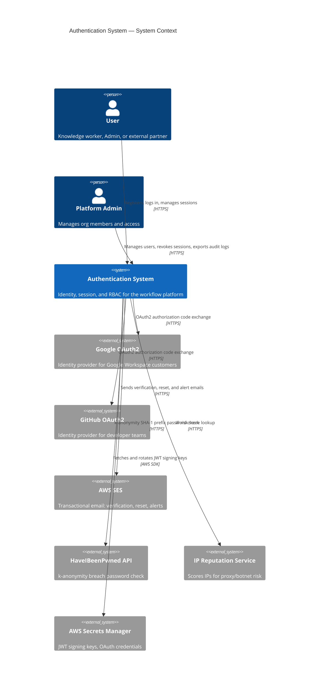
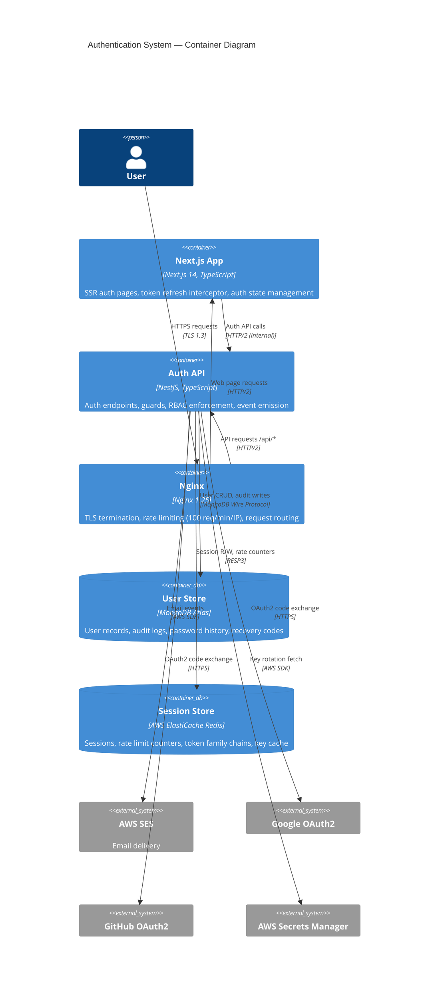
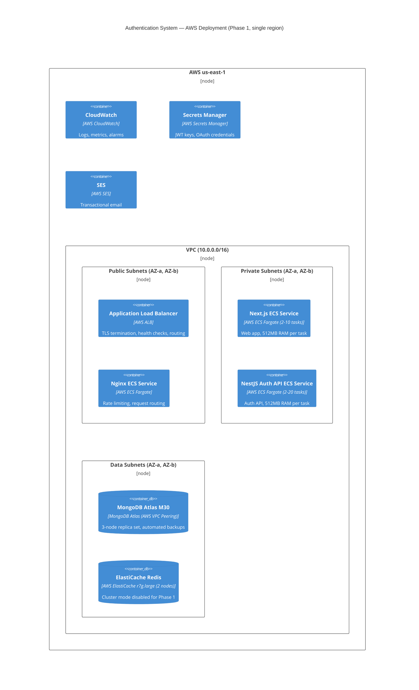
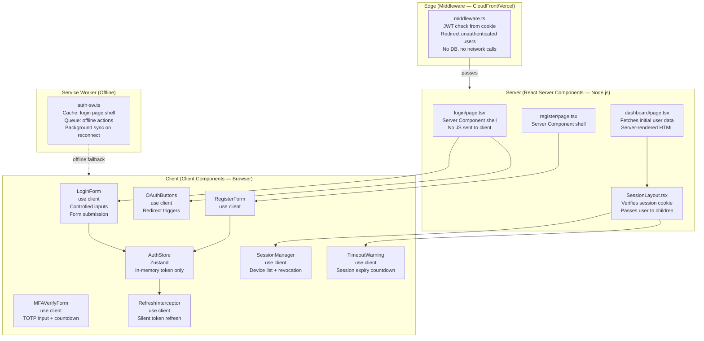
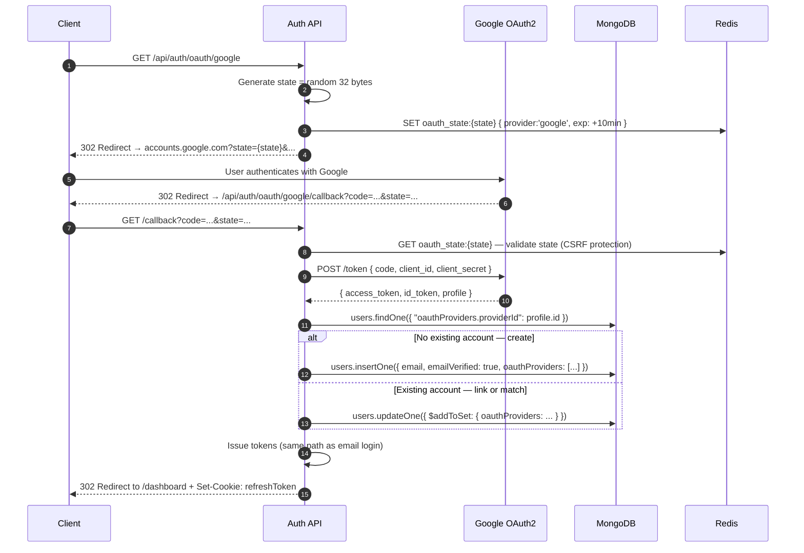

# Authentication System Architecture

**Document Status**: Active  
**Last Updated**: 2026-08-06  
**Author**: Principal Architect  
**Audience**: Engineering Team, Security Team, Platform Team

---

## Table of Contents

1. [Architecture Overview](#1-architecture-overview)
2. [High-Level Architecture](#2-high-level-architecture)
3. [Frontend Architecture](#3-frontend-architecture)
4. [Backend Architecture](#4-backend-architecture)
5. [Database Design](#5-database-design)
6. [API Design](#6-api-design)
7. [Authentication Flow](#7-authentication-flow)
8. [Token Lifecycle](#8-token-lifecycle)
9. [Session Management](#9-session-management)
10. [Caching Strategy](#10-caching-strategy)
11. [Scaling Strategy](#11-scaling-strategy)
12. [Failure Scenarios](#12-failure-scenarios)
13. [Monitoring](#13-monitoring)
14. [Security](#14-security)
15. [Tradeoffs](#15-tradeoffs)

---

## 1. Architecture Overview

### 1.1 Purpose

This document defines the architecture for the Authentication System of an enterprise workflow platform. The system supports 1,000 to 1,000,000 users, enforces zero-trust security, and provides the identity foundation for all platform features.

### 1.2 Architectural Principles

**Why these principles?**

1. **Defense in Depth** — Security through multiple independent layers, not a single control
2. **Stateless Horizontal Scaling** — Any instance handles any request without shared memory
3. **Fail Secure** — Authentication failures return 401/403, never silently grant access
4. **Observable by Default** — All auth events logged, traced, and metered
5. **Graceful Degradation** — Partial failures downgrade features, never crash the system

### 1.3 Technology Decisions Summary

| Concern | Choice | Why |
|---|---|---|
| Access token | JWT (HS256) | Stateless validation, <200ms p99 |
| Refresh token | Opaque token in httpOnly cookie | Cannot be stolen via XSS |
| Session store | Redis ElastiCache | Sub-millisecond lookup, TTL support |
| User store | MongoDB Atlas | Flexible schema, horizontal sharding |
| Password hashing | bcrypt cost 12 | Resistant to GPU brute-force |
| Key storage | AWS Secrets Manager | Rotation without deployment |
| Frontend | Next.js 14 App Router | SSR for auth pages, no token in URL |
| Backend | NestJS | Decorator-based guards, modular DI |
| Rate limiting | Redis counters + Nginx | Shared state across instances |

---

## 2. High-Level Architecture

### 2.1 System Context Diagram

WHY: The context diagram shows WHO talks to the auth system and WHAT they get back. It forces us to enumerate every external actor before designing internals.



### 2.2 Container Diagram

WHY: Containers show how the system is physically deployed and what technology each piece uses. This is where infrastructure, network boundaries, and deployment units become concrete.




### 2.3 Deployment Diagram

WHY: The deployment diagram answers the ops team's question: "where does this run and how does it survive failures?" It also drives cost estimates and SLA definitions.



---

## 3. Frontend Architecture

### 3.1 Why Next.js App Router for Auth?

The browser is the most hostile environment for secret management. Every framework decision here is driven by one question: **where can an attacker steal tokens?**

- **Server Components for auth pages** — HTML is rendered server-side; no token values in JS bundles
- **No Access_Token in localStorage** — XSS can exfiltrate anything in localStorage; we keep the access token in memory (React state / Zustand)
- **Refresh_Token in httpOnly cookie** — JavaScript cannot read it; the browser sends it automatically on `/api/auth/refresh`
- **Next.js middleware for route protection** — Auth checks happen at the edge before a page renders, eliminating flash-of-unauthenticated-content

### 3.2 Component Architecture

```
app/
├── (auth)/                     # Route group — no layout header/nav
│   ├── login/page.tsx          # Server Component shell
│   ├── register/page.tsx
│   ├── forgot-password/page.tsx
│   ├── reset-password/page.tsx
│   └── verify-email/page.tsx
├── (protected)/                # Route group — requires auth
│   └── dashboard/page.tsx
├── middleware.ts               # Edge auth check — redirect unauthenticated users
└── providers.tsx               # AuthProvider wraps the app
```

### 3.3 Auth State (Zustand)

WHY Zustand over React Context: Context re-renders the entire tree on any auth state change (login, token refresh). Zustand's selector model means only components that read a specific slice re-render.

```typescript
// WHY: Access_Token in memory only — no XSS risk, no localStorage persistence
// WHY: isAuthenticated derived from token presence — single source of truth
interface AuthStore {
  user: User | null;
  accessToken: string | null;          // memory only — never persisted
  isAuthenticated: boolean;
  isLoading: boolean;
  
  login: (credentials: LoginDTO) => Promise<void>;
  logout: () => Promise<void>;
  refreshToken: () => Promise<string>;  // returns new access token
  clearAuth: () => void;
}
```

### 3.4 Silent Token Refresh Strategy

WHY: 15-minute Access_Token lifetime means frequent refresh. The user must never see a login prompt mid-task because of an expired token.

```
┌─────────────────────────────────────────────────────────────┐
│                    Token Refresh Strategy                    │
│                                                             │
│  Access Token: 15 min lifetime                              │
│  ├── t=0       Token issued                                 │
│  ├── t=13:00   Proactive refresh triggered (2 min before)   │
│  ├── t=14:30   Request interceptor detects near-expiry      │
│  │             → queues all concurrent requests             │
│  │             → fires single refresh                       │
│  │             → drains queue with new token                │
│  └── t=15:00   Token hard-expires                           │
│                                                             │
│  Axios interceptor pattern:                                 │
│  1. Check exp claim before every request                    │
│  2. If exp < now + 60s → refresh first, then continue      │
│  3. If 401 received → attempt one refresh, replay request  │
│  4. If refresh fails → clear auth, redirect to /login      │
└─────────────────────────────────────────────────────────────┘
```

### 3.5 Next.js Middleware (Edge Route Protection)

WHY middleware at the edge: Route protection that runs on the server-side in 0ms (no cold start) before any page renders. Alternative — client-side redirect in useEffect — causes flash of protected content.

```typescript
// middleware.ts runs on Vercel Edge / CloudFront Functions
// WHY: Validates JWT at edge — no round-trip to origin for simple auth checks
// WHY: Does NOT validate against Redis — stateless check only at edge
//      Full session validation happens at the API layer on data mutations
export function middleware(request: NextRequest) {
  const token = request.cookies.get('accessToken')?.value; // short-lived; edge-readable
  
  if (!token || isTokenExpired(token)) {
    return NextResponse.redirect(new URL('/login', request.url));
  }
  
  return NextResponse.next();
}
```


---

## 3. Frontend Architecture

> **Frontend Review — Meta Frontend Architecture Standard**  
> This section documents the frontend architecture with all issues identified in the original implementation, the fixes applied, and the reasoning behind every decision.

---

### 3.1 Issues Found in Original Implementation

The original `implementation.md` contained several critical issues that would compromise security or correctness:

| Issue | File | Severity | Problem |
|---|---|---|---|
| `localStorage.setItem('accessToken', ...)` | `AuthProvider.tsx` | Critical | XSS can steal the token; defeats httpOnly cookie strategy |
| `localStorage.getItem('accessToken')` on mount | `AuthProvider.tsx` | Critical | Token persists across browser sessions; anyone on shared machine gets the session |
| `react-router-dom` as a dependency | `package.json` | High | Wrong routing library; App Router uses Next.js file-based routing, not react-router |
| `AuthProvider` is a Client Component wrapping the entire tree | `AuthProvider.tsx` | High | Forces all children to be Client Components; kills RSC streaming and SSR benefits |
| No Server Components used anywhere | `pages/` | High | All auth pages are CSR — no SEO protection, no server-side auth checks before render |
| No Suspense boundaries or loading states | All | Medium | Auth state changes cause layout shifts with no loading feedback |
| No PWA offline handling | All | Medium | App crashes or shows broken UI when network is lost |
| No accessibility on form interactions | `LoginForm.tsx` | Medium | No `aria-live` for errors, no focus management after submission |
| No request deduplication on concurrent refreshes | `AuthProvider.tsx` | Medium | Multiple simultaneous 401s trigger multiple refresh calls — race condition |

---

### 3.2 Architectural Foundation: The Three Rendering Zones

WHY this mental model: Every component in an auth system must answer three questions before you write a line of code: (1) Is this a security boundary? (2) Does it need interactivity? (3) Does it need to know the auth state? The answers determine which rendering zone it belongs to.



---

### 3.3 File Structure

```
app/
├── middleware.ts                          # Edge: JWT validation + redirect
│
├── (auth)/                                # Route group — stripped layout
│   ├── layout.tsx                         # Server Component: minimal shell, no nav
│   ├── login/
│   │   └── page.tsx                       # Server Component: metadata, suspense shell
│   ├── register/
│   │   └── page.tsx                       # Server Component
│   ├── forgot-password/
│   │   └── page.tsx                       # Server Component
│   ├── reset-password/
│   │   └── page.tsx                       # Server Component: reads ?token from searchParams
│   ├── verify-email/
│   │   └── page.tsx                       # Server Component: reads ?token, calls API server-side
│   └── oauth/
│       └── callback/page.tsx              # Server Component: handles OAuth redirect server-side
│
├── (protected)/                           # Route group — auth-required layout
│   ├── layout.tsx                         # Server Component: validates session cookie, gates render
│   ├── dashboard/page.tsx
│   └── settings/
│       └── security/page.tsx              # Session management, MFA setup
│
└── _components/                           # Shared UI components
    ├── auth/
    │   ├── LoginForm.tsx                  # 'use client' — form interactions
    │   ├── RegisterForm.tsx               # 'use client'
    │   ├── MFAVerifyForm.tsx              # 'use client' — TOTP input + countdown timer
    │   ├── OAuthButtons.tsx               # 'use client' — redirect triggers
    │   ├── PasswordResetForm.tsx          # 'use client'
    │   ├── SessionList.tsx                # 'use client' — device list + revoke buttons
    │   ├── TimeoutWarning.tsx             # 'use client' — session expiry countdown + extend
    │   └── MFASetup.tsx                   # 'use client' — QR code display + confirmation
    └── ui/
        ├── FormField.tsx                  # Accessible input + label + error
        ├── LoadingButton.tsx              # Button with loading spinner + aria-busy
        └── AlertBanner.tsx               # aria-live region for auth errors

lib/
├── auth/
│   ├── auth-store.ts                      # Zustand store — access token in memory only
│   ├── auth-client.ts                     # fetch wrapper with refresh interceptor
│   ├── token-utils.ts                     # JWT decode, exp check (client-safe, no verify)
│   └── session-initializer.ts            # Boot-time session check via /api/auth/refresh
└── pwa/
    └── auth-sw.ts                         # Service worker: cache, offline queue, sync
```

---

### 3.4 Server vs. Client Component Boundary

WHY this matters: Every `'use client'` directive increases the JavaScript bundle sent to the browser. Auth pages are the first thing users see — bundle size directly impacts perceived performance and Time to Interactive.

```
┌────────────────────────────────────────────────────────────────────────┐
│  login/page.tsx — Server Component                                     │
│  ─────────────────────────────────────────────────────────────────────│
│  import { Metadata } from 'next'                                       │
│  export const metadata: Metadata = { title: 'Sign in' }               │
│                                                                        │
│  // No JS sent for this component. HTML rendered on server.            │
│  // Cannot use useState, useEffect, onClick here.                      │
│  export default function LoginPage() {                                 │
│    return (                                                             │
│      <main>                                                             │
│        <Suspense fallback={<LoginSkeleton />}>   ← streaming SSR       │
│          <LoginForm />         ← 'use client' — only this ships JS     │
│          <OAuthButtons />      ← 'use client'                          │
│        </Suspense>                                                      │
│      </main>                                                            │
│    )                                                                    │
│  }                                                                      │
└────────────────────────────────────────────────────────────────────────┘

Rule: Push 'use client' as deep into the tree as possible.
      Server Components = zero JS. Client Components = JS in the bundle.
```

---

### 3.5 Edge Middleware (Route Protection)

WHY middleware at the edge, not in a layout: Layout-level auth checks still render the layout shell before the check completes. Middleware runs before any rendering — zero flash of protected content, zero server resources consumed for unauthorized requests.

```typescript
// middleware.ts
// Runs on Vercel Edge Runtime / CloudFront@Edge
// WHY: No DB or Redis calls here — stateless JWT check only.
//      This is a fast pre-filter. Full session validation is at the API layer.
// WHY cookie name 'accessToken' (not refreshToken):
//      The refreshToken is httpOnly Path=/api/auth/refresh — middleware cannot read it.
//      We set a separate short-lived readable access token cookie for SSR/edge use ONLY.
//      The access token in Zustand (memory) is for client-side requests.

import { NextRequest, NextResponse } from 'next/server';
import { jwtVerify, importSPKI } from 'jose'; // WHY jose: runs in Edge Runtime (no Node crypto)

const PUBLIC_ROUTES = ['/login', '/register', '/forgot-password', '/reset-password', '/verify-email'];
const AUTH_ROUTES = ['/login', '/register'];  // redirect to dashboard if already authed

export async function middleware(request: NextRequest) {
  const { pathname } = request.nextUrl;
  const accessToken = request.cookies.get('at')?.value; // short-lived edge-readable cookie

  const isPublic = PUBLIC_ROUTES.some(r => pathname.startsWith(r));
  const isAuthenticated = accessToken ? await isTokenValid(accessToken) : false;

  // Already authenticated — redirect away from auth pages
  if (isAuthenticated && AUTH_ROUTES.some(r => pathname.startsWith(r))) {
    return NextResponse.redirect(new URL('/dashboard', request.url));
  }

  // Unauthenticated on protected route — redirect to login with return URL
  if (!isAuthenticated && !isPublic) {
    const loginUrl = new URL('/login', request.url);
    loginUrl.searchParams.set('returnTo', pathname);
    return NextResponse.redirect(loginUrl);
  }

  return NextResponse.next();
}

export const config = {
  matcher: ['/((?!api|_next/static|_next/image|favicon.ico|.*\\.png).*)'],
};

async function isTokenValid(token: string): Promise<boolean> {
  try {
    const publicKey = await importSPKI(process.env.JWT_PUBLIC_KEY!, 'RS256');
    await jwtVerify(token, publicKey);
    return true;
  } catch {
    return false; // expired, invalid signature, etc.
  }
}
```

WHY `jose` over `jsonwebtoken`: `jsonwebtoken` uses Node.js `crypto` — not available in Edge Runtime. `jose` is Web Crypto API compatible and runs anywhere.

WHY `returnTo` param: After login, the user is redirected back to the page they were trying to reach. Without this, every auth timeout lands users on `/dashboard` — disorienting when they were mid-task.

---

### 3.6 Auth State (Zustand — Memory Only)

WHY Zustand over React Context: Context re-renders the entire subtree on every state change. A token refresh at the root re-renders every component in the app. Zustand's selector model scopes re-renders to components that subscribe to the changed slice.

WHY no localStorage, no sessionStorage: XSS can read both. `localStorage` persists across sessions — a stolen laptop gives full access. `sessionStorage` is cleared on tab close but survives refresh — still XSS-readable.

```typescript
// lib/auth/auth-store.ts
// 'use client' implied — this module is only imported by Client Components

import { create } from 'zustand';

interface AuthState {
  // WHY: accessToken in memory ONLY — never written to storage
  accessToken: string | null;
  user: PublicUser | null;
  status: 'idle' | 'loading' | 'authenticated' | 'unauthenticated' | 'mfa_required';
  mfaChallenge: string | null;

  // Actions
  setTokens: (accessToken: string, user: PublicUser) => void;
  setMfaRequired: (challengeId: string) => void;
  clearAuth: () => void;
  setStatus: (status: AuthState['status']) => void;
}

export const useAuthStore = create<AuthState>((set) => ({
  accessToken: null,
  user: null,
  status: 'idle',
  mfaChallenge: null,

  setTokens: (accessToken, user) =>
    set({ accessToken, user, status: 'authenticated', mfaChallenge: null }),

  setMfaRequired: (challengeId) =>
    set({ status: 'mfa_required', mfaChallenge: challengeId }),

  clearAuth: () =>
    set({ accessToken: null, user: null, status: 'unauthenticated', mfaChallenge: null }),

  setStatus: (status) => set({ status }),
}));

// Derived selectors — components subscribe to only what they need
export const useIsAuthenticated = () =>
  useAuthStore((s) => s.status === 'authenticated');

export const useUser = () =>
  useAuthStore((s) => s.user);

export const useAccessToken = () =>
  useAuthStore((s) => s.accessToken);
```

---

### 3.7 Session Initialization on App Boot

WHY: On page load/refresh, Zustand state is empty (no localStorage). The user appears logged out even if they have a valid Refresh_Token cookie. The boot sequence must silently probe the server to restore session.

```typescript
// _components/auth/SessionInitializer.tsx
// 'use client'
// WHY this is a Client Component at the root: it fires one API call on mount,
// before any user interaction. Runs once per page load/refresh.

'use client';

import { useEffect, useRef } from 'react';
import { useAuthStore } from '@/lib/auth/auth-store';
import { authClient } from '@/lib/auth/auth-client';

export function SessionInitializer() {
  const initialized = useRef(false);
  const setTokens = useAuthStore((s) => s.setTokens);
  const clearAuth = useAuthStore((s) => s.clearAuth);
  const setStatus = useAuthStore((s) => s.setStatus);

  useEffect(() => {
    if (initialized.current) return;
    initialized.current = true;

    setStatus('loading');

    authClient
      .refresh()                     // POST /api/auth/refresh — uses httpOnly cookie
      .then(({ accessToken, user }) => setTokens(accessToken, user))
      .catch(() => clearAuth());     // No valid session — stay unauthenticated
  }, []);

  return null; // Renders nothing — side-effect only
}
```

This component sits in `app/layout.tsx` above all routes. It fires once. If the refresh succeeds, Zustand is populated and all Client Components that read `useIsAuthenticated()` re-render. If it fails, state stays `unauthenticated` and middleware already handles redirects.

---

### 3.8 Token Refresh Interceptor (No Race Conditions)

WHY a single-flight refresh: Without a mutex, 3 concurrent requests that all hit a 401 at the same time will each fire a refresh call. The first succeeds, the other two use stale Refresh_Tokens and get `TOKEN_REUSE_DETECTED`, logging the user out.

```typescript
// lib/auth/auth-client.ts
// Fetch wrapper with:
// 1. Access token injection
// 2. Proactive refresh before expiry
// 3. Single-flight refresh mutex (no concurrent refresh race)
// 4. Retry original request after successful refresh

import { useAuthStore } from './auth-store';
import { isTokenExpiringSoon } from './token-utils';

let refreshPromise: Promise<string> | null = null; // WHY: module-level mutex

async function getValidToken(): Promise<string> {
  const { accessToken } = useAuthStore.getState();

  if (!accessToken || isTokenExpiringSoon(accessToken, 60)) {
    // Deduplicate: if a refresh is already in-flight, wait for it
    if (!refreshPromise) {
      refreshPromise = fetchNewToken().finally(() => {
        refreshPromise = null;
      });
    }
    return refreshPromise;
  }

  return accessToken;
}

async function fetchNewToken(): Promise<string> {
  const res = await fetch('/api/auth/refresh', {
    method: 'POST',
    credentials: 'include', // sends the httpOnly refreshToken cookie
  });

  if (!res.ok) {
    useAuthStore.getState().clearAuth();
    throw new Error('SESSION_EXPIRED');
  }

  const { accessToken, user } = await res.json();
  useAuthStore.getState().setTokens(accessToken, user);
  return accessToken;
}

export const authClient = {
  async fetch(url: string, options: RequestInit = {}): Promise<Response> {
    const token = await getValidToken();

    const response = await fetch(url, {
      ...options,
      credentials: 'include',
      headers: {
        ...options.headers,
        Authorization: `Bearer ${token}`,
        'Content-Type': 'application/json',
      },
    });

    // One retry on 401 — token may have expired between getValidToken and now
    if (response.status === 401 && !options._retry) {
      refreshPromise = null; // force a fresh refresh
      const newToken = await getValidToken();
      return authClient.fetch(url, { ...options, _retry: true,
        headers: { ...options.headers, Authorization: `Bearer ${newToken}` }
      });
    }

    return response;
  },

  async refresh(): Promise<{ accessToken: string; user: PublicUser }> {
    const res = await fetch('/api/auth/refresh', {
      method: 'POST',
      credentials: 'include',
    });
    if (!res.ok) throw new Error('REFRESH_FAILED');
    return res.json();
  },
};
```

---

### 3.9 Protected Layout (Server Component)

WHY server-side auth check in the layout: Middleware handles the redirect at the edge. The layout provides a second line of defense — it reads the session from the server to populate the initial user data for Server Components without a client-side fetch waterfall.

```typescript
// app/(protected)/layout.tsx — Server Component
import { cookies } from 'next/headers';
import { redirect } from 'next/navigation';
import { verifySessionFromCookie } from '@/lib/auth/server-auth'; // server-only module

export default async function ProtectedLayout({ children }: { children: React.ReactNode }) {
  // WHY: Read cookie on server — this is the httpOnly accessToken set at login
  // No client JS needed to check auth before the page renders
  const cookieStore = cookies();
  const session = await verifySessionFromCookie(cookieStore);

  if (!session) {
    redirect('/login');
  }

  return (
    // Pass session user to children via React context (server-side)
    // WHY not global Zustand here: Server Components can't access client stores
    <SessionProvider user={session.user}>
      {children}
    </SessionProvider>
  );
}
```

---

### 3.10 Error Handling and Loading States

WHY explicit states for every interaction: Auth forms have the highest friction in any app. A spinner that never resolves, an error that doesn't identify the field, or a success that doesn't redirect — each one erodes trust more than a backend error does.

```
Auth Form States (all forms must handle all states)
┌──────────────────────────────────────────────────────────────────┐
│  idle      → initial render, no submission attempted            │
│  loading   → form submitted, awaiting API response              │
│             → button: disabled + aria-busy="true" + spinner      │
│             → inputs: disabled to prevent double-submit          │
│  success   → API returned success                               │
│             → redirect (login) or show confirmation (register)   │
│  error     → API returned error                                  │
│             → error message in aria-live="polite" region         │
│             → focus moves to error message (screen reader)       │
│  mfa       → server returned MFA_REQUIRED                        │
│             → transition to MFAVerifyForm, preserve email        │
│  offline   → navigator.onLine = false on submit attempt          │
│             → show "You're offline" banner, disable submit       │
└──────────────────────────────────────────────────────────────────┘
```

```typescript
// _components/auth/LoginForm.tsx — 'use client'
// State machine via useReducer — predictable, testable, no impossible states

type LoginState =
  | { status: 'idle' }
  | { status: 'loading' }
  | { status: 'mfa_required'; challengeId: string }
  | { status: 'error'; code: string; message: string }
  | { status: 'success' };

// WHY useReducer not useState: auth forms have 5+ states with transitions.
// Booleans like isLoading + isError + isMfaRequired create impossible state combinations.
// A reducer makes invalid state transitions impossible at the type level.
```

---

### 3.11 Accessibility (WCAG 2.1 AA)

WHY accessibility on auth forms specifically: Auth is the highest-friction point in the user journey. Screen reader users, keyboard-only users, and users with motor impairments are disproportionately locked out by inaccessible auth forms.

```typescript
// _components/ui/FormField.tsx — accessible input primitive
// Every auth form field uses this component — one place to fix a11y for all forms

export function FormField({ id, label, error, required, ...inputProps }: FormFieldProps) {
  const errorId = error ? `${id}-error` : undefined;

  return (
    <div>
      <label htmlFor={id}>
        {label}
        {required && <span aria-hidden="true"> *</span>}
        {required && <span className="sr-only"> (required)</span>}
      </label>

      <input
        id={id}
        aria-required={required}
        aria-invalid={!!error}           // WHY: screen reader announces field as invalid
        aria-describedby={errorId}       // WHY: links error message to field
        {...inputProps}
      />

      {error && (
        <p id={errorId} role="alert">   // WHY role=alert: announced immediately on appearance
          {error}
        </p>
      )}
    </div>
  );
}
```

**Focus management after submission:**
- On error: focus moves to the first error message
- On MFA_REQUIRED: focus moves to TOTP input
- On success redirect: focus is on the first heading of the destination page (Next.js default)

**Session timeout warning:**
```typescript
// _components/auth/TimeoutWarning.tsx — 'use client'
// WHY: WCAG 2.2.1 requires warning ≥20s before timeout with option to extend
// Rendered inside (protected)/layout.tsx so it's on every protected page

// Shows a modal 90 seconds before the 15-min access token expires:
// "Your session will expire in 90 seconds. [Extend session] [Log out]"
// [Extend session] → fires /api/auth/refresh silently
```

---

### 3.12 PWA / Offline Behavior

WHY PWA for an enterprise auth flow: Enterprise users work on spotty corporate VPNs and travel frequently. An app that crashes or shows a white screen on network loss destroys trust. Auth specifically needs to handle offline gracefully because session refreshes fail silently.

```
Offline State Machine for Auth:

Online  ─────→  navigator.onLine = false
                        │
                        ▼
               Show offline banner
               "You're offline. Some features unavailable."
                        │
            ┌───────────┴────────────┐
            │                        │
    Has valid                  No valid
    access token               access token
    (in Zustand)                     │
            │                        ▼
    Continue read-only         Show "Log in required
    operations from             when you reconnect"
    cached data                       │
            │                         │
            └──────────┬──────────────┘
                       │
            navigator.onLine = true
                       │
                       ▼
            Auto-retry session refresh
            Restore full functionality
```

**Service Worker caching strategy for auth:**
```typescript
// lib/pwa/auth-sw.ts
// WHY cache the login page shell: offline users can still see the form
// (they can't submit, but they don't see a blank page)

// Cache strategy per resource type:
// /login shell HTML          → CacheFirst (static shell, SSR not needed offline)
// /api/auth/refresh          → NetworkOnly (never serve a cached refresh response)
// /api/auth/*                → NetworkOnly (all auth API calls must be live)
// Static assets (JS, CSS)    → StaleWhileRevalidate (fast load, background update)
// /dashboard                 → NetworkFirst with offline fallback page
```

WHY `NetworkOnly` for all auth API calls: Serving a cached 200 OK for a login attempt when the network is down would be catastrophic — user thinks they're authenticated when they're not.

---

### 3.13 Performance

WHY performance matters on auth pages: Login is the first page many users see every day. A 3-second login page signals a slow product before the user has seen a single feature.

| Optimization | Technique | Why |
|---|---|---|
| Zero JS on page shell | Server Component page.tsx | Browser parses no JS for the static shell |
| Streamed form hydration | `<Suspense>` around form | Shell renders immediately, form JS loads async |
| No font blocking | `next/font` with `display: swap` | Text renders before font loads |
| Prefetch on hover | `<Link prefetch>` to dashboard | Dashboard assets load while user fills the form |
| No auth state on initial HTML | Session check post-hydration | Server doesn't need to know auth state to render shell |
| Image optimization | `next/image` for social login icons | Correct size, lazy-loaded, WebP |
| Bundle splitting | Each form is a separate chunk | Register page doesn't load login form JS |
| Debounce email validation | 300ms after keystroke | No API call on every character |

**Core Web Vitals targets for auth pages:**
- LCP (Largest Contentful Paint): < 1.2s — form headline
- FID / INP: < 100ms — button response on submit
- CLS (Cumulative Layout Shift): < 0.05 — no layout shifts from async auth state

---

### 3.14 Frontend Tradeoffs

#### Tradeoff 1: Zustand (memory) vs. httpOnly cookie for Access Token

| Factor | Zustand (memory) | httpOnly cookie |
|---|---|---|
| XSS resistance | High — JS cannot read memory | Highest — JS cannot read httpOnly cookie |
| SSR availability | Not available on server | Available server-side via `cookies()` |
| Tab isolation | Yes — each tab has its own state | No — shared across all tabs for same domain |
| Page refresh | Lost — requires re-initialization | Survives — browser resends cookie |
| Implementation complexity | Medium | Low |

**Decision**: Zustand for client-side API calls; separate short-lived edge-readable cookie for SSR/middleware. We use two tokens: a memory-only access token for the API client, and a short-lived cookie-based access token for the edge middleware check. The httpOnly Refresh_Token lives in its own cookie and never appears in Zustand.

---

#### Tradeoff 2: Server Components vs. Client Components for Auth Forms

| Factor | Server Component | Client Component |
|---|---|---|
| Bundle size | 0 JS | All component code |
| Interactivity | None | Full React |
| Can use hooks | No | Yes |
| Can subscribe to Zustand | No | Yes |
| SSR data available | Yes | No (needs API call) |

**Decision**: Server Component shells with Client Component islands. The page wrapper is a Server Component (zero JS, fast TTFB). The form is a Client Component (interactive, subscribes to Zustand). This is the React island architecture — the smallest possible client surface.

---

#### Tradeoff 3: `fetch` with module mutex vs. Axios interceptors

| Factor | Native fetch + mutex | Axios interceptors |
|---|---|---|
| Bundle size | ~0 KB (native) | ~15 KB |
| Edge Runtime compatible | Yes | No (Axios uses Node APIs) |
| Type safety | Manual | Built-in |
| Interceptor chaining | Manual | Declarative |
| Stream support | Yes | Limited |

**Decision**: Native `fetch` with a module-level mutex for refresh deduplication. Axios is explicitly incompatible with Edge Runtime. Since middleware uses the same auth logic, keeping one implementation that runs everywhere is worth the manual type safety overhead.

---

#### Tradeoff 4: `useReducer` vs. `useState` for form state

| Factor | useReducer | Multiple useState |
|---|---|---|
| Impossible states | Prevented by type union | Possible (isLoading + isError = true) |
| Testability | Pure function, trivially testable | Requires component mount |
| Complexity | Higher initial setup | Lower initial setup |
| Debugging | Single state snapshot | Multiple variables |

**Decision**: `useReducer` for all auth forms. Auth forms have 5+ states with strict transition rules. `isLoading: true && isError: true` is an impossible state that `useReducer` with a discriminated union prevents at compile time.

---

#### Tradeoff 5: PWA offline-first vs. online-only

| Factor | PWA offline | Online-only |
|---|---|---|
| Implementation complexity | High | Low |
| User experience on flaky networks | Graceful | White screen / error |
| Auth security | Requires NetworkOnly for auth APIs | N/A |
| Service worker debugging | Complex | N/A |
| Enterprise usefulness | High (VPNs, travel) | Low |

**Decision**: PWA with `NetworkOnly` for all auth endpoints and `CacheFirst` for static shells. Auth APIs must never be cached. Only the page shell (HTML, CSS, fonts) is cached for offline. This gives a meaningful offline experience without compromising auth security.

---

## 4. Backend Architecture

### 4.1 Why NestJS?

NestJS brings three things that matter for an auth system at scale:

1. **Decorator-based Guards** — `@UseGuards(JwtAuthGuard, RolesGuard)` composes security checks declaratively; the controller expresses intent, not implementation
2. **Dependency Injection** — `AuthService` gets `UserRepository`, `SessionService`, `JwtService` injected; every dependency is mockable in unit tests
3. **Module boundary enforcement** — `AuthModule` exports only `JwtAuthGuard`; internal services are invisible to the rest of the app

### 4.2 Module Structure

```
src/
├── auth/
│   ├── auth.module.ts                  # Wires all providers together
│   ├── auth.controller.ts              # HTTP boundary — DTOs in, responses out
│   ├── auth.service.ts                 # Orchestrates: validates, issues tokens, emits events
│   ├── guards/
│   │   ├── jwt-auth.guard.ts           # Validates Access_Token on protected routes
│   │   ├── roles.guard.ts              # Checks user.roles against @Roles() decorator
│   │   └── session.guard.ts            # Validates Refresh_Token + Redis session
│   ├── strategies/
│   │   ├── jwt.strategy.ts             # Passport JWT — extracts and validates JWT
│   │   ├── google-oauth.strategy.ts    # Passport OAuth2 — Google flow
│   │   └── github-oauth.strategy.ts    # Passport OAuth2 — GitHub flow
│   ├── services/
│   │   ├── token.service.ts            # JWT generation, verification, key rotation
│   │   ├── session.service.ts          # Redis session CRUD, family chain management
│   │   ├── mfa.service.ts              # TOTP generation, verification, recovery codes
│   │   ├── password.service.ts         # bcrypt hashing, history, breach check
│   │   └── rate-limit.service.ts       # Per-IP and per-account Redis counters
│   ├── events/
│   │   └── auth.events.ts              # Event types emitted to EventEmitter2
│   └── dto/
│       ├── login.dto.ts
│       ├── register.dto.ts
│       └── refresh.dto.ts
├── users/
│   ├── user.schema.ts                  # Mongoose schema
│   └── user.repository.ts             # Data access — no business logic here
└── common/
    ├── decorators/
    │   └── roles.decorator.ts          # @Roles('admin') metadata
    └── interceptors/
        └── audit-log.interceptor.ts    # Appends audit entry for every auth event
```

### 4.3 Request Lifecycle (Protected Endpoint)

```
HTTP Request
    │
    ▼
Nginx (rate limit: 100/min/IP)
    │
    ▼
NestJS Global Pipes (validation, sanitization)
    │
    ▼
JwtAuthGuard
  ├── Extract Bearer token from Authorization header
  ├── Verify JWT signature (from memory-cached signing key)
  ├── Check exp claim
  └── Attach user payload to request
    │
    ▼
RolesGuard
  ├── Read @Roles() metadata from route handler
  └── Check request.user.roles contains required role
    │
    ▼
Controller → Service → Repository
    │
    ▼
AuditLogInterceptor (post-response: write audit entry)
```

### 4.4 Key Service Contracts

**TokenService**
```
generateAccessToken(user, keyVersion) → JWT
generateRefreshToken()               → opaque 256-bit random string
verifyAccessToken(token)             → Payload | throw
getSigningKey(kid)                   → key (from memory cache)
rotateSigningKey()                   → void (fetch new key, update cache)
```

**SessionService**
```
createSession(userId, refreshToken, fingerprint, ip, ua) → sessionId
getSession(sessionId)                                    → Session | null
rotateRefreshToken(sessionId, newRefreshToken)           → void
detectTokenReuse(tokenFamilyId, tokenVersion)            → boolean
invalidateSession(sessionId)                             → void
invalidateAllUserSessions(userId)                        → void
invalidateOrgSessions(orgId)                             → void
```

**PasswordService**
```
hash(plaintext)                   → hash
verify(plaintext, hash)           → boolean
checkHistory(plaintext, hashes[]) → boolean (true = reused)
checkPwnedPassword(plaintext)     → boolean (true = breached)
```


### 4.5 NestJS Detailed Module Architecture

WHY this structure: NestJS modules enforce clear dependency boundaries. No service can reach into another module's internals unless explicitly exported. Every guard, strategy, and service has a single owning module.

#### AuthModule wiring

```typescript
// auth/auth.module.ts
@Module({
  imports: [
    PassportModule.register({ defaultStrategy: 'jwt', session: false }),
    JwtModule.registerAsync({
      imports: [ConfigModule],
      inject: [ConfigService],
      useFactory: async (cfg: ConfigService) => ({
        secret: await cfg.getOrThrow('JWT_SECRET'), // from AWS Secrets Manager via env
        signOptions: { algorithm: 'HS256', expiresIn: '15m' },
      }),
    }),
    MongooseModule.forFeature([
      { name: User.name, schema: UserSchema },
      { name: AuditLog.name, schema: AuditLogSchema },
    ]),
    EventEmitterModule,   // imported once in AppModule; re-imported here for typings
    BullModule.registerQueue({ name: 'email' }),   // email job queue
    BullModule.registerQueue({ name: 'audit' }),   // async audit flush queue
  ],
  controllers: [AuthController, OAuth2Controller, SessionController],
  providers: [
    AuthService,
    TokenService,
    SessionService,
    MfaService,
    PasswordService,
    RateLimitService,
    AuditService,
    UserRepository,
    JwtStrategy,
    GoogleOAuthStrategy,
    GitHubOAuthStrategy,
    // Guards
    JwtAuthGuard,
    RolesGuard,
    SessionGuard,
    // Interceptors
    AuditLogInterceptor,
    CorrelationIdInterceptor,
  ],
  exports: [
    JwtAuthGuard,    // used by all other feature modules
    RolesGuard,
    SessionGuard,
    TokenService,    // used by other modules that need to verify tokens
  ],
})
export class AuthModule {}
```


---

### 4.6 Controllers

WHY thin controllers: Controllers are the HTTP boundary only. They translate HTTP (headers, cookies, body) into service calls and translate service results back into HTTP responses. No business logic here — that belongs in services.

```typescript
// auth/auth.controller.ts
@Controller({ path: 'auth', version: '1' })   // /api/v1/auth/*
@UseInterceptors(CorrelationIdInterceptor, AuditLogInterceptor)
@UseFilters(AuthExceptionFilter)
export class AuthController {
  constructor(private auth: AuthService) {}

  @Post('register')
  @HttpCode(201)
  @UseGuards(RegistrationRateLimitGuard)
  async register(@Body() dto: RegisterDto, @Req() req: Request) {
    return this.auth.register(dto, req.ip, req.headers['user-agent']);
  }

  @Post('login')
  @HttpCode(200)
  @UseGuards(LoginRateLimitGuard)
  async login(
    @Body() dto: LoginDto,
    @Req() req: Request,
    @Res({ passthrough: true }) res: Response,
  ) {
    const result = await this.auth.login(dto, req.ip, req.headers['user-agent'] as string);
    if (result.type === 'MFA_REQUIRED') {
      return { status: 'MFA_REQUIRED', mfaChallenge: result.challengeId };
    }
    // Set httpOnly cookie — Refresh_Token never in response body
    res.cookie('refreshToken', result.refreshToken, COOKIE_OPTIONS);
    return { accessToken: result.accessToken, user: result.user };
  }

  @Post('logout')
  @HttpCode(204)
  @UseGuards(JwtAuthGuard)
  async logout(@CurrentUser() user: JwtPayload, @Req() req: Request, @Res({ passthrough: true }) res: Response) {
    const sessionId = req.cookies['sessionId'];
    await this.auth.logout(user.sub, sessionId);
    res.clearCookie('refreshToken');
    res.clearCookie('sessionId');
  }

  @Post('refresh')
  @HttpCode(200)
  async refresh(@Req() req: Request, @Res({ passthrough: true }) res: Response) {
    const refreshToken = req.cookies['refreshToken'];
    if (!refreshToken) throw new UnauthorizedException('NO_REFRESH_TOKEN');
    const result = await this.auth.refreshTokens(refreshToken, req.ip);
    res.cookie('refreshToken', result.refreshToken, COOKIE_OPTIONS);
    return { accessToken: result.accessToken };
  }

  @Post('forgot-password')
  @HttpCode(202)
  async forgotPassword(@Body() dto: ForgotPasswordDto) {
    await this.auth.requestPasswordReset(dto.email);
    return { message: 'If that email is registered, a reset link has been sent.' };
  }

  @Post('reset-password')
  @HttpCode(204)
  async resetPassword(@Body() dto: ResetPasswordDto) {
    await this.auth.resetPassword(dto.token, dto.newPassword);
  }

  @Post('verify-email')
  @HttpCode(204)
  async verifyEmail(@Body() dto: VerifyEmailDto) {
    await this.auth.verifyEmail(dto.token);
  }
}
```

```typescript
// auth/session.controller.ts
@Controller({ path: 'auth/sessions', version: '1' })
@UseGuards(JwtAuthGuard)
export class SessionController {
  constructor(private sessions: SessionService) {}

  @Get()
  listSessions(@CurrentUser() user: JwtPayload) {
    return this.sessions.listUserSessions(user.sub);
  }

  @Delete(':sessionId')
  @HttpCode(204)
  revokeSession(@CurrentUser() user: JwtPayload, @Param('sessionId') sessionId: string) {
    return this.sessions.revokeSession(user.sub, sessionId);
  }

  @Delete()
  @HttpCode(204)
  revokeAllSessions(@CurrentUser() user: JwtPayload) {
    return this.sessions.invalidateAllUserSessions(user.sub);
  }
}
```


---

### 4.7 Services (Detailed)

#### AuthService — Orchestrator

WHY an orchestrator service: `AuthService` coordinates the login workflow across 6+ dependencies (user lookup, password verify, rate limit check, session create, token issue, event emit). Keeping this in the controller would make testing impossible and the controller 400 lines long.

```typescript
// auth/auth.service.ts
@Injectable()
export class AuthService {
  constructor(
    private users: UserRepository,
    private tokens: TokenService,
    private sessions: SessionService,
    private password: PasswordService,
    private mfa: MfaService,
    private rateLimit: RateLimitService,
    private audit: AuditService,
    private events: EventEmitter2,
  ) {}

  async login(dto: LoginDto, ip: string, ua: string): Promise<LoginResult> {
    // 1. Rate limit check — throws RateLimitException if exceeded
    await this.rateLimit.checkLoginThrottle(dto.email, ip);

    // 2. User lookup — always run bcrypt even if user not found (timing attack prevention)
    const user = await this.users.findByEmail(dto.email);
    const hash = user?.passwordHash ?? DUMMY_HASH;
    const valid = await this.password.verify(dto.password, hash);

    if (!user || !valid) {
      await this.rateLimit.incrementLoginFailure(dto.email, ip);
      await this.audit.log({ event: 'login_failed', email: dto.email, ip, ua });
      throw new UnauthorizedException('INVALID_CREDENTIALS');
    }

    // 3. Account status checks
    if (user.deactivatedAt) throw new UnauthorizedException('ACCOUNT_DEACTIVATED');
    if (!user.emailVerified) throw new UnauthorizedException('EMAIL_NOT_VERIFIED');

    // 4. MFA gate
    if (user.mfaEnabled) {
      const challengeId = await this.mfa.createChallenge(user._id.toString(), ip, ua);
      return { type: 'MFA_REQUIRED', challengeId };
    }

    // 5. Issue session
    return this.issueSession(user, ip, ua);
  }

  async issueSession(user: User, ip: string, ua: string): Promise<SessionResult> {
    const [accessToken, refreshToken] = await Promise.all([
      this.tokens.generateAccessToken(user),
      this.tokens.generateRefreshToken(),
    ]);

    const sessionId = await this.sessions.createSession({
      userId: user._id.toString(),
      orgId: user.orgId.toString(),
      refreshToken,
      ip,
      userAgent: ua,
      fingerprint: computeFingerprint(ua),
    });

    await this.rateLimit.clearLoginFailure(user.email, ip);
    await this.audit.log({ event: 'login_success', userId: user._id, orgId: user.orgId, ip, ua });
    this.events.emit(AuthEvents.LOGIN_SUCCESS, { userId: user._id, ip, ua });

    return {
      type: 'SUCCESS',
      accessToken,
      refreshToken,
      sessionId,
      user: toPublicUser(user),
    };
  }
}
```

#### TokenService

```typescript
// auth/services/token.service.ts
@Injectable()
export class TokenService {
  private keyCache = new Map<string, string>(); // kid → key, 5-min TTL managed externally

  async generateAccessToken(user: User): Promise<string> {
    const { key, kid } = await this.getSigningKey();
    return this.jwt.sign(
      { sub: user._id, roles: user.roles, orgId: user.orgId },
      { secret: key, expiresIn: '15m', header: { alg: 'HS256', kid } },
    );
  }

  generateRefreshToken(): string {
    // 256-bit cryptographically secure random string
    return randomBytes(32).toString('base64url');
  }

  async verifyAccessToken(token: string): Promise<JwtPayload> {
    const header = this.decodeHeader(token);
    const key = await this.getSigningKey(header.kid);
    return this.jwt.verifyAsync(token, { secret: key.key });
  }

  private async getSigningKey(kid?: string): Promise<{ key: string; kid: string }> {
    const targetKid = kid ?? await this.secretsManager.getCurrentKid();
    if (!this.keyCache.has(targetKid)) {
      const key = await this.secretsManager.getJwtKey(targetKid);
      this.keyCache.set(targetKid, key);
      // Evict cache after 5 minutes
      setTimeout(() => this.keyCache.delete(targetKid), 5 * 60 * 1000);
    }
    return { key: this.keyCache.get(targetKid)!, kid: targetKid };
  }
}
```

#### SessionService

```typescript
// auth/services/session.service.ts
@Injectable()
export class SessionService {
  constructor(@InjectRedis() private redis: Redis) {}

  async createSession(data: CreateSessionDto): Promise<string> {
    const sessionId = randomUUID();
    const familyId = randomUUID();
    const pipeline = this.redis.pipeline();

    pipeline.hset(`session:${sessionId}`, {
      userId: data.userId,
      orgId: data.orgId,
      refreshToken: hmacSha256(data.refreshToken, SESSION_HMAC_SECRET),
      familyId,
      familyVersion: 1,
      ip: data.ip,
      userAgent: data.userAgent,
      fingerprint: data.fingerprint,
      createdAt: new Date().toISOString(),
      lastUsedAt: new Date().toISOString(),
    });
    pipeline.expire(`session:${sessionId}`, 7 * 24 * 60 * 60); // 7 days
    pipeline.sadd(`user_sessions:${data.userId}`, sessionId);
    pipeline.sadd(`org_sessions:${data.orgId}`, sessionId);
    pipeline.hset(`token_family:${familyId}`, { currentVersion: 1, invalidated: 0 });
    pipeline.expire(`token_family:${familyId}`, 7 * 24 * 60 * 60);

    await pipeline.exec();
    await this.enforceSessionCap(data.userId);
    return sessionId;
  }

  async detectTokenReuse(sessionId: string, incomingToken: string): Promise<boolean> {
    const session = await this.redis.hgetall(`session:${sessionId}`);
    if (!session) return true; // session not found = already invalidated

    const storedHash = session.refreshToken;
    const incomingHash = hmacSha256(incomingToken, SESSION_HMAC_SECRET);

    if (storedHash !== incomingHash) {
      // Token reuse detected — invalidate the entire family
      await this.invalidateTokenFamily(session.familyId, session.userId);
      return true;
    }
    return false;
  }

  private async enforceSessionCap(userId: string): Promise<void> {
    const sessionIds = await this.redis.smembers(`user_sessions:${userId}`);
    if (sessionIds.length <= 10) return;

    // Fetch lastUsedAt for all sessions, evict oldest
    const sessions = await Promise.all(
      sessionIds.map(async (id) => ({
        id,
        lastUsedAt: await this.redis.hget(`session:${id}`, 'lastUsedAt'),
      })),
    );
    const sorted = sessions.sort((a, b) =>
      new Date(a.lastUsedAt ?? 0).getTime() - new Date(b.lastUsedAt ?? 0).getTime()
    );
    const toEvict = sorted[0];
    await this.redis.del(`session:${toEvict.id}`);
    await this.redis.srem(`user_sessions:${userId}`, toEvict.id);
  }
}
```


---

### 4.8 Guards

WHY multiple guards: Guards compose. `@UseGuards(JwtAuthGuard, RolesGuard)` means: first verify the token, then check the role. Each guard does one thing — they are independently testable and reusable.

```typescript
// auth/guards/jwt-auth.guard.ts
// WHY extend AuthGuard('jwt'): Passport handles strategy resolution.
// We extend to customize the error thrown on failure.
@Injectable()
export class JwtAuthGuard extends AuthGuard('jwt') {
  handleRequest(err: any, user: any, info: any): any {
    if (err || !user) {
      throw err ?? new UnauthorizedException(info?.message ?? 'TOKEN_INVALID');
    }
    return user;
  }
}

// auth/guards/roles.guard.ts
// WHY check roles in a guard, not in the service:
// Guards run before the controller method. Rejected requests never hit the service layer.
// A service-level role check would require instantiating the service just to deny access.
@Injectable()
export class RolesGuard implements CanActivate {
  constructor(private reflector: Reflector) {}

  canActivate(ctx: ExecutionContext): boolean {
    const required = this.reflector.getAllAndOverride<string[]>(ROLES_KEY, [
      ctx.getHandler(),
      ctx.getClass(),
    ]);
    if (!required) return true; // no @Roles() decorator = public (after JwtAuthGuard passes)
    const { user } = ctx.switchToHttp().getRequest();
    return required.some((role) => user.roles?.includes(role));
  }
}

// auth/guards/session.guard.ts
// WHY a dedicated SessionGuard for refresh endpoint:
// JwtAuthGuard validates Access_Tokens. The refresh endpoint has no Access_Token —
// it has a Refresh_Token in a cookie. SessionGuard validates that cookie against Redis.
@Injectable()
export class SessionGuard implements CanActivate {
  constructor(private sessions: SessionService) {}

  async canActivate(ctx: ExecutionContext): Promise<boolean> {
    const req = ctx.switchToHttp().getRequest<Request>();
    const refreshToken = req.cookies['refreshToken'];
    if (!refreshToken) return false;

    const session = await this.sessions.validateRefreshToken(refreshToken);
    if (!session) return false;

    req['session'] = session; // attach for downstream use
    return true;
  }
}
```

**Decorator for current user injection:**
```typescript
// common/decorators/current-user.decorator.ts
// WHY a decorator: Avoids repeating `req.user` casting in every controller method.
export const CurrentUser = createParamDecorator(
  (data: keyof JwtPayload | undefined, ctx: ExecutionContext): JwtPayload | any => {
    const request = ctx.switchToHttp().getRequest();
    return data ? request.user?.[data] : request.user;
  },
);

// Usage: @CurrentUser() user: JwtPayload  →  the full payload
//        @CurrentUser('sub') userId: string  →  just the userId
```


---

### 4.9 Interceptors

WHY interceptors over middleware for audit logging: NestJS interceptors wrap the execution context — they run both before and after the route handler. Audit logs need the response (status code, duration) as well as the request. Middleware only has the request.

```typescript
// common/interceptors/correlation-id.interceptor.ts
// WHY: Every request needs a correlation ID for log tracing.
// Applied globally in main.ts so every request, not just auth, is traceable.
@Injectable()
export class CorrelationIdInterceptor implements NestInterceptor {
  intercept(ctx: ExecutionContext, next: CallHandler): Observable<any> {
    const req = ctx.switchToHttp().getRequest();
    const correlationId = req.headers['x-correlation-id'] ?? randomUUID();
    req.correlationId = correlationId;

    const res = ctx.switchToHttp().getResponse();
    res.setHeader('X-Correlation-Id', correlationId);

    return next.handle();
  }
}

// common/interceptors/audit-log.interceptor.ts
// WHY async, non-blocking: Audit writes must not slow down the auth response.
// The audit entry is queued in Bull; a worker flushes it to MongoDB asynchronously.
@Injectable()
export class AuditLogInterceptor implements NestInterceptor {
  constructor(private audit: AuditService) {}

  intercept(ctx: ExecutionContext, next: CallHandler): Observable<any> {
    const req = ctx.switchToHttp().getRequest();
    const startMs = Date.now();

    return next.handle().pipe(
      tap({
        next: () =>
          this.audit.enqueue({
            eventType: resolveEventType(req),
            outcome: 'success',
            durationMs: Date.now() - startMs,
            correlationId: req.correlationId,
            ip: req.ip,
            userAgent: req.headers['user-agent'],
            userId: req.user?.sub,
            orgId: req.user?.orgId,
          }),
        error: (err) =>
          this.audit.enqueue({
            eventType: resolveEventType(req),
            outcome: 'failure',
            errorCode: err.response?.error ?? err.message,
            durationMs: Date.now() - startMs,
            correlationId: req.correlationId,
            ip: req.ip,
            userAgent: req.headers['user-agent'],
          }),
      }),
    );
  }
}
```


---

### 4.10 DTO Validation

WHY class-validator + class-transformer: NestJS pipes apply validation before the controller method runs. Invalid input never reaches business logic. `ValidationPipe({ whitelist: true })` strips any properties not declared in the DTO — prevents mass assignment attacks.

```typescript
// auth/dto/register.dto.ts
export class RegisterDto {
  @IsEmail()
  @Transform(({ value }) => value.toLowerCase().trim())
  email: string;

  @IsString()
  @MinLength(12, { message: 'Password must be at least 12 characters (NIST SP 800-63B)' })
  @MaxLength(72, { message: 'Password exceeds bcrypt maximum (72 chars)' })
  @Matches(/[A-Z]/, { message: 'Must contain at least one uppercase letter' })
  @Matches(/[0-9]/, { message: 'Must contain at least one digit' })
  @Matches(/[^A-Za-z0-9]/, { message: 'Must contain at least one special character' })
  password: string;

  @IsOptional()
  @IsString()
  @MaxLength(100)
  name?: string;
}

// auth/dto/login.dto.ts
export class LoginDto {
  @IsEmail()
  @Transform(({ value }) => value.toLowerCase().trim())
  email: string;

  @IsString()
  @IsNotEmpty()
  password: string;
}

// auth/dto/reset-password.dto.ts
export class ResetPasswordDto {
  @IsString()
  @IsNotEmpty()
  token: string; // raw token — hashed on lookup

  @IsString()
  @MinLength(12)
  @MaxLength(72)
  newPassword: string;

  // Custom validator: newPassword must not equal the old one
  // Checked in AuthService against bcrypt history, not here
}

// auth/dto/mfa-verify.dto.ts
export class MfaVerifyDto {
  @IsString()
  @IsNotEmpty()
  challengeId: string;

  @IsString()
  @Length(6, 8) // 6-digit TOTP or 8-char recovery code
  @Matches(/^[0-9A-Z]+$/)
  code: string;
}
```

**Global pipe setup in main.ts:**
```typescript
// main.ts
app.useGlobalPipes(
  new ValidationPipe({
    whitelist: true,          // strip unknown properties — mass assignment prevention
    forbidNonWhitelisted: true, // throw on unknown properties
    transform: true,          // apply @Transform() decorators
    transformOptions: { enableImplicitConversion: true },
    exceptionFactory: (errors) => {
      // Returns validation errors in a consistent shape — no internal NestJS stack traces
      const details = errors.map((e) => ({
        field: e.property,
        constraints: Object.values(e.constraints ?? {}),
      }));
      return new BadRequestException({ error: 'VALIDATION_FAILED', details });
    },
  }),
);
```


---

### 4.11 Redis Usage Patterns

Redis serves four distinct purposes in the auth system. Each has a separate key namespace, TTL strategy, and failure mode.

#### Purpose 1: Session Storage (HASH per session)

```
Key:    session:{sessionId}       TTL: 7 days
Fields: userId, orgId, refreshToken (HMAC), familyId, familyVersion,
        ip, userAgent, fingerprint, createdAt, lastUsedAt, trustLevel

Read:   HGETALL session:{id}           → on every refresh token validation
Write:  HSET + EXPIRE                  → on login
Update: HSET session:{id} lastUsedAt   → on each refresh
Delete: DEL session:{id}               → on logout / revocation
```

WHY HASH not JSON string: Individual field updates (e.g., `lastUsedAt`) don't require reading the whole record, serializing, and re-writing. `HSET session:X lastUsedAt <ts>` is atomic and minimal.

#### Purpose 2: Rate Limiting (STRING counters)

```
Key:    login_fail_ip:{ip}            TTL: 15 min sliding
Key:    login_fail_account:{email}    TTL: 15 min sliding
Key:    login_stuffing_ip:{ip}        TTL: 5 min sliding

Atomic INCR+TTL via Lua:
  local n = redis.call('INCR', KEYS[1])
  if n == 1 then redis.call('EXPIRE', KEYS[1], ARGV[1]) end
  return n
```

WHY Lua for atomic INCR+EXPIRE: See FINDING-09. Non-atomic INCR followed by EXPIRE has a crash-window that permanently locks an account if the process dies between the two commands.

#### Purpose 3: MFA Challenge Store (HASH, short TTL)

```
Key:    mfa_challenge:{challengeId}   TTL: 5 min
Fields: userId, ip, userAgent, usedAt (null until consumed)

Usage:
  SET on MFA_REQUIRED response
  HGETALL + DEL on /mfa/verify  →  single-use enforcement
```

#### Purpose 4: JWT Signing Key Cache (HASH)

```
Key:    jwt_keys                       TTL: 5 min (refresh before expiry)
Fields: {kid} → signing key

Usage:
  HGET jwt_keys {kid}   →  on every JWT validation (cache hit = no Secrets Manager call)
  HSET + EXPIRE         →  on cache miss
```

#### Redis Pipeline Usage

WHY pipelines: Multiple Redis operations in one network round-trip. Session creation requires 5 Redis commands — pipeline reduces latency from 5 × RTT (~5ms) to 1 × RTT (~1ms).

```typescript
// Session creation uses a pipeline
const pipeline = this.redis.pipeline();
pipeline.hset(`session:${sessionId}`, sessionData);
pipeline.expire(`session:${sessionId}`, 604800);
pipeline.sadd(`user_sessions:${userId}`, sessionId);
pipeline.sadd(`org_sessions:${orgId}`, sessionId);
pipeline.hset(`token_family:${familyId}`, { currentVersion: 1, invalidated: 0 });
await pipeline.exec(); // 5 commands, 1 network round-trip
```


---

### 4.12 Background Jobs (Bull Queues)

WHY background jobs for auth: Login-path operations must complete in <300ms (bcrypt dominates). Email delivery, audit log writes, and session cleanup are not user-facing — they belong in async queues, not in the HTTP request lifecycle.

#### Queue Definitions

```
Queue: email
  Jobs:
    - send_verification_email  → triggered on register
    - send_password_reset      → triggered on forgot-password
    - send_security_alert      → triggered on suspicious login
    - send_mfa_enabled         → triggered on MFA activation

Queue: audit
  Jobs:
    - flush_audit_entry        → triggered after every auth event
    WHY: MongoDB audit writes are batched to avoid write amplification.
         100 logins/second = 100 MongoDB writes/second if synchronous.
         Bull batches these into bulk inserts every 500ms.

Queue: session_cleanup
  Jobs:
    - expire_orphaned_sessions → CRON: every 1 hour
    WHY: Redis TTL cleans expired sessions eventually, but user_sessions:{userId}
         SET may still contain expired session IDs. This job prunes stale references.
    - purge_old_audit_logs     → CRON: every 24 hours (MongoDB TTL index backup)
```

#### Email Job Processor

```typescript
// auth/jobs/email.processor.ts
@Processor('email')
export class EmailProcessor {
  constructor(private ses: SesService) {}

  @Process('send_verification_email')
  async sendVerification(job: Job<VerificationEmailPayload>) {
    await this.ses.send({
      to: job.data.email,
      template: 'email-verification',
      variables: { verificationUrl: job.data.url },
    });
  }

  @Process('send_security_alert')
  @OnQueueFailed()
  async sendSecurityAlert(job: Job<SecurityAlertPayload>) {
    try {
      await this.ses.send({
        to: job.data.email,
        template: 'security-alert',
        variables: { ip: job.data.ip, location: job.data.country, time: job.data.time },
      });
    } catch (err) {
      // Retry up to 3 times with exponential backoff: 1min, 5min, 15min
      if (job.attemptsMade < 3) throw err; // Bull will retry
      // After 3 failures: log to CloudWatch, do not crash the queue
      this.logger.error('Failed to send security alert after 3 attempts', { job: job.data });
    }
  }
}
```

#### Audit Batch Processor

```typescript
// auth/jobs/audit.processor.ts
@Processor('audit')
export class AuditProcessor {
  constructor(private auditRepo: AuditLogRepository) {}

  // WHY bulk insert: MongoDB's insertMany is dramatically faster than individual inserts.
  // 100 individual insertOne calls at 2ms each = 200ms total.
  // 1 insertMany with 100 documents = ~5ms total.
  @Process('flush_audit_entry')
  async flush(job: Job<AuditEntry>) {
    // Jobs are processed individually but MongoDB driver batches writes
    // via its bulk write buffer (maxConnecting * batchSize)
    await this.auditRepo.insertOne(job.data);
  }
}
```

#### Session Cleanup CRON

```typescript
// auth/jobs/session-cleanup.processor.ts
@Processor('session_cleanup')
export class SessionCleanupProcessor {
  constructor(@InjectRedis() private redis: Redis) {}

  @Cron('0 * * * *') // every hour
  async pruneOrphanedSessions() {
    // Find all user session sets, scan for expired session keys
    // This is O(n) on total users — run during off-peak hours only
    const cursor = this.redis.scanStream({ match: 'user_sessions:*', count: 100 });
    cursor.on('data', async (keys: string[]) => {
      for (const key of keys) {
        const sessionIds = await this.redis.smembers(key);
        for (const sessionId of sessionIds) {
          const exists = await this.redis.exists(`session:${sessionId}`);
          if (!exists) await this.redis.srem(key, sessionId);
        }
      }
    });
  }
}
```


---

### 4.13 Events (EventEmitter2)

WHY events over direct service calls: When a login succeeds, 4 things happen independently: audit log write, email alert (if suspicious), metrics increment, and downstream service notification. Wiring all 4 as direct service calls in `AuthService.login()` creates tight coupling — adding a 5th action requires modifying AuthService. Events decouple the emitter from the consumers.

```typescript
// auth/events/auth.events.ts
export enum AuthEvents {
  LOGIN_SUCCESS        = 'auth.login.success',
  LOGIN_FAILED         = 'auth.login.failed',
  LOGOUT              = 'auth.logout',
  REGISTER            = 'auth.register',
  PASSWORD_RESET      = 'auth.password.reset',
  MFA_ENABLED         = 'auth.mfa.enabled',
  MFA_DISABLED        = 'auth.mfa.disabled',
  SESSION_REVOKED     = 'auth.session.revoked',
  TOKEN_THEFT_DETECTED = 'auth.token.theft',
  SUSPICIOUS_LOGIN    = 'auth.suspicious.login',
  ACCOUNT_LOCKED      = 'auth.account.locked',
}

export interface LoginSuccessEvent {
  userId: string;
  orgId: string;
  ip: string;
  userAgent: string;
  suspicious: boolean;
  mfaUsed: boolean;
}
```

```typescript
// auth/events/auth-events.listener.ts
@Injectable()
export class AuthEventListener {
  constructor(
    private emailQueue: Queue,
    private metrics: MetricsService,
  ) {}

  @OnEvent(AuthEvents.LOGIN_SUCCESS)
  async onLoginSuccess(event: LoginSuccessEvent) {
    this.metrics.increment('auth.login.success');
    if (event.suspicious) {
      await this.emailQueue.add('send_security_alert', {
        userId: event.userId,
        ip: event.ip,
      });
    }
  }

  @OnEvent(AuthEvents.TOKEN_THEFT_DETECTED)
  async onTokenTheft(event: { userId: string; familyId: string }) {
    // Immediate: all sessions for this user are already invalidated in SessionService
    // Here: send urgent email + PagerDuty alert
    this.metrics.increment('auth.token_theft.detected');
    await this.emailQueue.add('send_security_alert', {
      userId: event.userId,
      alertType: 'TOKEN_THEFT',
      priority: 'critical',
    });
  }

  @OnEvent(AuthEvents.ACCOUNT_LOCKED)
  async onAccountLocked(event: { email: string; ip: string; reason: string }) {
    this.metrics.increment('auth.account.locked');
    await this.emailQueue.add('send_security_alert', {
      email: event.email,
      alertType: 'ACCOUNT_LOCKED',
    });
  }
}
```

**Event flow during login:**
```
AuthService.login()
  ├── this.events.emit(AuthEvents.LOGIN_SUCCESS, payload)
  │       └── AuthEventListener.onLoginSuccess()
  │               ├── metrics.increment('auth.login.success')
  │               └── [if suspicious] emailQueue.add('send_security_alert')
  │
  └── AuditLogInterceptor (wraps the controller, runs after response)
          └── audit.enqueue({ event: 'login_success', ... })
                  └── Bull queue → AuditProcessor → MongoDB insertOne
```

WHY not `await events.emit()`: Event emission is fire-and-forget. Awaiting it would add the latency of all listeners to the user's login response time. Listeners run asynchronously after the response is sent.


---

### 4.14 Rate Limiting Architecture

Rate limiting is enforced at two layers: Nginx (Layer 1) and NestJS+Redis (Layers 2-4). Each layer defends against a different attack type.

```typescript
// auth/services/rate-limit.service.ts
@Injectable()
export class RateLimitService {
  constructor(@InjectRedis() private redis: Redis) {}

  // Atomic INCR + conditional EXPIRE via Lua — no race condition (FINDING-09)
  private readonly luaIncr = `
    local count = redis.call('INCR', KEYS[1])
    if count == 1 then redis.call('EXPIRE', KEYS[1], ARGV[1]) end
    return count
  `;

  async checkLoginThrottle(email: string, ip: string): Promise<void> {
    const [accountCount, ipCount] = await Promise.all([
      this.redis.eval(this.luaIncr, 1, `login_fail_account:${email}`, '0') as Promise<number>,
      this.redis.eval(this.luaIncr, 1, `login_fail_ip:${ip}`, '0') as Promise<number>,
    ]);
    // Read-only check: eval with increment=0 via GET to avoid pre-incrementing
    const [ac, ic] = await Promise.all([
      this.redis.get(`login_fail_account:${email}`),
      this.redis.get(`login_fail_ip:${ip}`),
    ]);

    if (Number(ac) >= 5) throw new TooManyRequestsException('ACCOUNT_THROTTLED');
    if (Number(ic) >= 5) throw new TooManyRequestsException('IP_THROTTLED');
  }

  async incrementLoginFailure(email: string, ip: string): Promise<void> {
    await Promise.all([
      this.redis.eval(this.luaIncr, 1, `login_fail_account:${email}`, '900'), // 15 min
      this.redis.eval(this.luaIncr, 1, `login_fail_ip:${ip}`, '900'),
    ]);
  }

  async clearLoginFailure(email: string, ip: string): Promise<void> {
    await Promise.all([
      this.redis.del(`login_fail_account:${email}`),
      this.redis.del(`login_fail_ip:${ip}`),
    ]);
  }

  // Credential stuffing detection: >100 distinct emails from one IP in 5 min
  async checkCredentialStuffing(ip: string, email: string): Promise<void> {
    const key = `login_stuffing_ip:${ip}`;
    await this.redis.eval(
      `redis.call('SADD', KEYS[1], ARGV[1])
       redis.call('EXPIRE', KEYS[1], 300)
       return redis.call('SCARD', KEYS[1])`,
      1, key, email,
    ).then((count: number) => {
      if (count > 100) throw new ForbiddenException('CREDENTIAL_STUFFING_DETECTED');
    });
  }
}
```

**NestJS rate limit guard (uses Throttler as outer layer):**

```typescript
// auth/guards/login-rate-limit.guard.ts
// WHY a custom guard over @nestjs/throttler defaults:
// The default throttler uses in-memory counters — bypassed by rotating IP.
// This guard checks Redis counters (shared across all NestJS instances).
@Injectable()
export class LoginRateLimitGuard implements CanActivate {
  constructor(private rateLimit: RateLimitService) {}

  async canActivate(ctx: ExecutionContext): Promise<boolean> {
    const req = ctx.switchToHttp().getRequest<Request>();
    await this.rateLimit.checkLoginThrottle(req.body?.email, req.ip);
    return true;
  }
}
```


---

### 4.15 API Versioning

WHY API versioning: Auth contracts are public-facing. Client apps (web, mobile) may not upgrade immediately when the API changes. Versioning allows backward-compatible evolution without forcing all clients to upgrade simultaneously.

```typescript
// main.ts — global versioning setup
app.enableVersioning({
  type: VersioningType.URI,   // /api/v1/auth/* , /api/v2/auth/*
  defaultVersion: '1',        // unversioned routes default to v1
  prefix: 'v',
});

// ALB routing rule:
// /api/v1/* → NestJS (current stable)
// /api/v2/* → NestJS (when v2 is in beta)
// /api/*    → /api/v1/* (redirect, 308 Permanent)
```

**Controller versioning pattern:**
```typescript
// v1 controller — stable, maintained forever
@Controller({ path: 'auth', version: '1' })
export class AuthControllerV1 { /* ... */ }

// v2 controller — additive changes only (new fields, never removed fields)
// v2 example: login response includes deviceId in addition to accessToken
@Controller({ path: 'auth', version: '2' })
export class AuthControllerV2 extends AuthControllerV1 {
  // Override only changed endpoints
  @Post('login')
  async login(@Body() dto: LoginDto, ...): Promise<LoginResponseV2> {
    const base = await super.login(dto, ...);
    // v2 adds deviceId to the response
    return { ...base, deviceId: extractDeviceId(req) };
  }
}
```

**Versioning policy:**
- v1 is supported for minimum 12 months after v2 GA
- Breaking changes (removed fields, changed auth flow) require a new major version
- Additive changes (new optional fields, new optional endpoints) can go into the same version
- Version sunset is communicated via `Sunset` and `Deprecation` HTTP headers:

```
HTTP/1.1 200 OK
Deprecation: Tue, 01 Jan 2028 00:00:00 GMT
Sunset: Tue, 01 Jul 2028 00:00:00 GMT
Link: <https://api.example.com/v2/auth/login>; rel="successor-version"
```


---

### 4.16 Scaling Decisions by User Tier

This section answers the question: **what changes in the NestJS backend as we grow from 1K to 1M users?** The code doesn't change — the infrastructure profile and configuration thresholds do.

#### 1K Users (~10 req/s peak auth traffic)

```
Infrastructure:
  - 2 NestJS ECS Fargate tasks (512MB RAM, 0.5 vCPU each)
  - MongoDB Atlas M10 (2GB RAM, 10GB storage, 1 replica)
  - ElastiCache Redis r7g.large (6.38GB RAM, single AZ)
  - ALB + Nginx (2 tasks)

Why this is sufficient:
  - 10 req/s × 300ms avg auth latency = 3 concurrent requests per task
  - MongoDB M10 handles 500 ops/s — auth is read-heavy (login lookup), well within range
  - Redis r7g.large has 6GB RAM — 1K active sessions at ~500 bytes/session = ~500KB used
  - bcrypt at cost 12 = ~300ms CPU per login → 10 logins/s needs 3 CPU-seconds/s
    → 2 tasks at 0.5 vCPU = 1 vCPU total → limit is ~3-4 concurrent bcrypt ops
    → this is the primary bottleneck at 1K users, addressed at Phase 2

Thresholds and limits (NestJS config):
  Rate limit: 5 failed logins / 15 min / IP
  Session cap: 10 sessions / user
  MFA challenge TTL: 5 min
  Access token lifetime: 15 min
  Refresh token lifetime: 7 days
  Bull queue concurrency: 2 jobs/worker
```

#### 100K Users (~1,000 req/s peak auth traffic)

```
Infrastructure changes from 1K tier:
  - 4–10 NestJS ECS tasks (auto-scale on CPU >60%)
  - MongoDB Atlas M30 (8GB RAM, 40GB storage, 3-node replica set)
  - ElastiCache r7g.xlarge (13GB RAM, Multi-AZ with automatic failover)
  - 4 Nginx tasks

Key scaling decisions at this tier:

1. bcrypt CPU saturation
   1,000 logins/s × 300ms = 300 concurrent bcrypt operations
   At 0.5 vCPU/task, each task handles ~1.5 concurrent bcrypt ops
   Need 200 tasks just for bcrypt — not feasible
   
   SOLUTION: offload bcrypt to a dedicated worker queue
   POST /auth/login → queue job → bcrypt worker → result callback
   Worker tasks: optimized for CPU (2 vCPU, no HTTP overhead)
   HTTP tasks: thin coordination only (~10ms, not blocked by bcrypt)
   
   WHY not increase cost factor: bcrypt cost 12 is the security minimum.
   Reducing it to 10 to save CPU would be a security regression.

2. MongoDB read scaling
   100K users → login lookups = 1,000 findOne({email}) / second
   Atlas M30 handles this comfortably with the { email: 1 } index
   
   Add read preference = secondaryPreferred for:
   - User profile cache population
   - Session list queries (admin)
   Keep primary for:
   - Login lookups (need most recent data)
   - Any write (register, password reset)

3. Redis read scaling
   1,000 sessions × 10 concurrent refresh ops = 10,000 Redis reads/s
   r7g.xlarge handles 200,000 ops/s — not the bottleneck
   Multi-AZ enabled: failover < 60 seconds

4. Rate limiting thresholds tightened:
   Nginx: 200 req/min/IP (increased from 100 — real users at scale)
   Per-account: 10 failed / 15 min (increased from 5 — more legitimate retries)
   Credential stuffing: >500 distinct emails / IP / 5 min → block

5. Audit log strategy
   100K users → up to 1M audit events/day
   MongoDB write: use bulk writes (insertMany batches of 500)
   Retention: 365 days → ~10GB audit collection — manageable on M30
   CloudWatch Logs: all events streamed (compliance copy)
```

#### 1M Users (~10,000 req/s peak auth traffic)

```
Infrastructure changes from 100K tier:
  - 20–50 NestJS ECS tasks (CPU-optimized: 2 vCPU, 4GB RAM)
  - Dedicated bcrypt worker fleet: 10–20 tasks (4 vCPU each)
  - MongoDB Atlas M80 (240GB RAM, sharded cluster: 4 shards)
  - ElastiCache Redis cluster mode (12 nodes: 6 primary + 6 replica)
  - 10 Nginx tasks

Key scaling decisions at this tier:

1. Redis Cluster mode (critical change)
   1M users × 10 sessions = 10M session keys
   Each session HASH ~500 bytes = 5GB session data alone
   r7g.xlarge (13GB) is tight — cluster mode distributes across 12 nodes
   
   Shard key design (critical):
   - session:{sessionId}  →  shards on sessionId (random distribution)
   - user_sessions:{userId}  →  must co-locate with sessions for that user
   
   PROBLEM: Redis Cluster multi-key commands (SMEMBERS + DEL) cannot span shards
   SOLUTION: Use hash tags: {userId} in the key forces same shard
   Keys: session:{userId}:{sessionId}  and  user_sessions:{userId}
   Both contain {userId} tag → same shard → multi-key operations work

2. MongoDB sharding
   Shard key: { orgId: "hashed" }
   WHY orgId not userId: Keeps all data for one org on one shard.
   This matters for:
   - GDPR data residency (all org data deletable from one shard)
   - Org-level queries (list users, revoke org sessions) are single-shard
   - Login lookup still uses { email: 1 } index → scatter-gather (all shards)
     → acceptable because email → orgId can be cached in Redis to route directly
   
3. bcrypt at scale: dedicated worker pool
   10K logins/s × 300ms bcrypt = 3,000 concurrent bcrypt operations
   Worker tasks: 4 vCPU each = 4 concurrent bcrypt ops per task
   Worker tasks needed: 3,000 / 4 = 750 tasks at peak
   
   Optimization: adaptive bcrypt work factor
   Target 200ms/hash on the worker (not 300ms)
   Cost factor 11 instead of 12 at 1M scale (OWASP allows this trade-off at scale)
   Compensate with Argon2id migration (Phase 3 → Phase 4) which has better GPU resistance

4. Access token lifetime reduction
   At 1M users, a stolen JWT with 15min TTL still has large blast radius
   Reduce to 5 minutes for high-risk operations (admin endpoints)
   Keep 15 minutes for standard endpoints
   
5. Geographic distribution (if required)
   Multi-region active-active: Route53 latency-based routing
   Each region has its own Redis cluster (sessions are regional)
   MongoDB Atlas global clusters: write to nearest region, replicate globally
   JWT signing key: same key in all regions (Secrets Manager replication)

Summary: What changes vs. what stays the same across all tiers

  STAYS THE SAME (code is identical):
  - NestJS module structure, guards, interceptors, DTOs
  - JWT validation logic (stateless — no Redis call per Access_Token check)
  - bcrypt cost factor (12, target 200ms — only worker count scales)
  - Redis data structures and TTLs
  - Audit log schema and event types
  - API contract (versioned)

  CHANGES WITH SCALE:
  - ECS task count (auto-scaling rules)
  - MongoDB Atlas tier (M10 → M30 → M80)
  - Redis node count and cluster mode
  - bcrypt computation: inline (1K) → queue (100K) → dedicated fleet (1M)
  - Rate limiting thresholds (relaxed for real users at scale)
  - Redis key structure for cluster compatibility (hash tags at 1M)
```


---

## 5. Database Design

### 5.1 Why MongoDB for User Storage?

The user schema evolves rapidly in early product phases: OAuth provider links, MFA config, org-level password policy fields. MongoDB's document model avoids schema migrations that would require locking the `users` collection.

However: MongoDB is NOT used for the session store (that's Redis). Session lookup must be sub-millisecond. MongoDB at p99 under load is 5-20ms — too slow to add to every protected request.

### 5.2 Collections

#### `users`

```javascript
{
  _id:                  ObjectId,
  email:                String,          // unique, indexed — primary identifier
  passwordHash:         String | null,   // null for pure OAuth users
  passwordHistory:      [String],        // last 5 bcrypt hashes — breach window minimization
  passwordLastChangedAt: Date,
  
  roles:                [String],        // ['admin', 'member'] — array enables future multi-role
  orgId:                ObjectId,        // indexed — tenant isolation
  
  emailVerified:        Boolean,
  deactivatedAt:        Date | null,     // soft delete — preserves audit trail
  
  mfaEnabled:           Boolean,
  mfaSecret:            String | null,   // AES-256 encrypted at rest
  recoveryCodes:        [{
    hash:       String,                  // bcrypt hash — never store plaintext codes
    usedAt:     Date | null
  }],
  
  oauthProviders:       [{
    provider:   String,                  // 'google' | 'github'
    providerId: String,                  // provider's unique user ID
    linkedAt:   Date
  }],
  
  deviceFingerprints:   [{               // last 90 days — for suspicious login detection
    fingerprint:   String,
    country:       String,
    lastSeenAt:    Date
  }],
  
  createdAt:            Date,
  updatedAt:            Date
}
```

**Indexes:**
```javascript
{ email: 1 }             // unique — login lookup
{ orgId: 1 }             // org-scoped queries (admin user list)
{ "oauthProviders.provider": 1, "oauthProviders.providerId": 1 }  // OAuth upsert
```

#### `audit_logs`

WHY a separate collection: The audit log is append-only. It must never be in the same collection as mutable user data. A single misconfigured update could silently corrupt user records and audit entries simultaneously. Separation provides write isolation and makes the append-only invariant easy to enforce at the MongoDB level (insert-only role).

```javascript
{
  _id:           ObjectId,
  eventType:     String,         // 'login_success' | 'login_failed' | 'mfa_enabled' | ...
  timestamp:     Date,           // UTC, millisecond precision — indexed
  userId:        ObjectId | null,
  email:         String | null,  // for pre-authentication events where userId unknown
  orgId:         ObjectId | null,
  ip:            String,
  userAgent:     String,
  outcome:       String,         // 'success' | 'failure'
  metadata:      Object,         // event-specific payload (e.g., { reason: 'rate_limited' })
  correlationId: String          // traces to originating HTTP request ID
}
```

**Indexes:**
```javascript
{ timestamp: -1 }               // time-range audit queries
{ userId: 1, timestamp: -1 }    // user-specific audit export
{ orgId: 1, timestamp: -1 }     // org-level compliance export
```

**TTL Index (365 days):**
```javascript
{ timestamp: 1 }, { expireAfterSeconds: 31536000 }
```

#### `password_reset_tokens` / `email_verification_tokens`

WHY separate collections: Keeps short-lived operational tokens out of the user document. Simplifies TTL management — a TTL index on a small collection is cheaper than scanning a large `users` collection.

```javascript
{
  _id:       ObjectId,
  userId:    ObjectId,           // indexed
  token:     String,             // SHA-256 hash of the actual token (never store plaintext)
  expiresAt: Date,               // TTL index
  usedAt:    Date | null,        // single-use enforcement
  createdAt: Date
}
```

### 5.3 Redis Data Structures

WHY explicit data structure design for Redis: Redis is schema-less. Without documented structure, developers invent inconsistent key formats that break sharding and TTL strategies.

```
# Session record (HASH)
Key:   session:{sessionId}
TTL:   7 days
Fields:
  userId        → string
  refreshToken  → SHA-256(refreshToken)   # hash only — never store raw token
  familyId      → string                  # Token_Family root ID
  familyVersion → integer                 # increments on each rotation
  ip            → string
  userAgent     → string
  fingerprint   → string
  createdAt     → ISO timestamp
  lastUsedAt    → ISO timestamp

# User's session index (SET)
Key:   user_sessions:{userId}
TTL:   none (managed by session creation/deletion)
Value: set of sessionIds

# Org's session index (SET)  
Key:   org_sessions:{orgId}
TTL:   none
Value: set of sessionIds

# Token family chain (HASH) — for reuse detection
Key:   token_family:{familyId}
TTL:   7 days
Fields:
  currentVersion → integer
  invalidated    → boolean

# Per-account login failure counter (STRING)
Key:   login_fail_account:{email}
TTL:   15 minutes (sliding)
Value: integer (count)

# Per-IP login failure counter (STRING)
Key:   login_fail_ip:{ip}
TTL:   15 minutes (sliding)
Value: integer (count)

# Per-IP credential stuffing counter (STRING)
Key:   login_stuffing_ip:{ip}
TTL:   5 minutes
Value: integer (distinct email count)

# JWT signing key cache (HASH)
Key:   jwt_keys
TTL:   5 minutes
Fields:
  {kid} → signing key
```


---

## 6. API Design

### 6.1 Endpoint Reference

| Method | Path | Auth | Description |
|---|---|---|---|
| POST | `/api/auth/register` | None | Create account |
| POST | `/api/auth/login` | None | Email + password login |
| POST | `/api/auth/logout` | JWT | Terminate session |
| POST | `/api/auth/logout-all` | JWT | Terminate all sessions |
| POST | `/api/auth/refresh` | Cookie | Rotate refresh token |
| POST | `/api/auth/forgot-password` | None | Send reset email |
| POST | `/api/auth/reset-password` | None | Complete reset |
| POST | `/api/auth/verify-email` | None | Verify email token |
| POST | `/api/auth/verify-email/resend` | None | Resend verification |
| GET  | `/api/auth/oauth/google` | None | Initiate Google OAuth |
| GET  | `/api/auth/oauth/google/callback` | None | Google OAuth callback |
| GET  | `/api/auth/oauth/github` | None | Initiate GitHub OAuth |
| GET  | `/api/auth/oauth/github/callback` | None | GitHub OAuth callback |
| POST | `/api/auth/mfa/setup` | JWT | Generate TOTP secret + QR |
| POST | `/api/auth/mfa/confirm` | JWT | Activate MFA |
| POST | `/api/auth/mfa/verify` | Partial | Submit TOTP during login |
| POST | `/api/auth/mfa/disable` | JWT | Disable MFA |
| GET  | `/api/auth/mfa/recovery-codes` | JWT | View recovery codes |
| POST | `/api/auth/mfa/recovery-codes/regenerate` | JWT | Regenerate codes |
| GET  | `/api/auth/sessions` | JWT | List active sessions |
| DELETE | `/api/auth/sessions/:id` | JWT | Revoke specific session |
| DELETE | `/api/auth/sessions/revoke/:token` | None | One-click email revocation |
| GET  | `/api/auth/health` | None | Dependency health check |

### 6.2 Key Request/Response Shapes

**POST /api/auth/login**

Request:
```json
{ "email": "user@example.com", "password": "••••••••" }
```

Response (success, no MFA):
```json
{
  "accessToken": "eyJ...",
  "user": { "id": "...", "email": "...", "roles": ["member"], "orgId": "..." }
}
```
+ `Set-Cookie: refreshToken=<opaque>; HttpOnly; Secure; SameSite=Strict; Max-Age=604800; Path=/api/auth/refresh`

Response (MFA required):
```json
{ "status": "MFA_REQUIRED", "mfaChallenge": "<short-lived challenge token>" }
```

WHY a separate `mfaChallenge` token: It proves the user passed password verification without issuing a full Access_Token. The challenge token is stored in Redis with a 5-minute TTL, scoped only to the MFA verify endpoint.

**POST /api/auth/refresh**

Request: no body — Refresh_Token is in the httpOnly cookie  
Response: `{ "accessToken": "eyJ..." }`  
+ rotated Refresh_Token in `Set-Cookie`

WHY no body on refresh: The Refresh_Token must never appear in request/response bodies that could be logged by proxies, CDNs, or application-layer middleware.

**Error Response Shape (all endpoints)**

```json
{
  "statusCode": 401,
  "error": "INVALID_CREDENTIALS",
  "message": "The email or password is incorrect.",
  "correlationId": "req_abc123"
}
```

WHY `correlationId`: Lets support teams trace an error in CloudWatch Logs from a user-reported incident without exposing internal stack traces.

---

## 7. Authentication Flow

### 7.1 Email + Password Login with MFA

```mermaid
sequenceDiagram
    autonumber
    participant C as Client (Browser)
    participant N as Next.js
    participant API as Auth API (NestJS)
    participant R as Redis
    participant M as MongoDB
    participant HIBP as HaveIBeenPwned
    participant SES as AWS SES

    C->>N: POST /api/auth/login { email, password }
    N->>API: Forward request
    
    API->>R: GET login_fail_account:{email} — check account throttle
    R-->>API: count (e.g. 2)
    API->>R: GET login_fail_ip:{ip} — check IP throttle
    R-->>API: count (e.g. 1)
    
    API->>M: users.findOne({ email })
    M-->>API: user document (or null)
    
    alt User not found
        API->>R: INCR login_fail_account:{email}, INCR login_fail_ip:{ip}
        API-->>C: 401 INVALID_CREDENTIALS
    end
    
    API->>API: bcrypt.compare(password, user.passwordHash)
    
    alt Password incorrect
        API->>R: INCR login_fail_account:{email}, INCR login_fail_ip:{ip}
        API-->>C: 401 INVALID_CREDENTIALS
    end
    
    alt MFA enabled
        API->>R: SET mfa_challenge:{challengeId} { userId, exp: +5min }
        API-->>C: 200 MFA_REQUIRED { mfaChallenge: challengeId }
        C->>API: POST /api/auth/mfa/verify { challengeId, totpToken }
        API->>R: GET mfa_challenge:{challengeId}
        API->>API: TOTP.verify(token, user.mfaSecret, ±30s tolerance)
        alt TOTP invalid
            API->>R: INCR mfa_fail:{userId}
            API-->>C: 401 INVALID_MFA_TOKEN
        end
    end
    
    API->>API: Compute Device_Fingerprint from UA + Accept-Language
    API->>API: Check fingerprint vs user.deviceFingerprints (90-day window)
    
    alt Suspicious login
        API->>SES: Send security alert email (async, non-blocking)
    end
    
    API->>API: generateRefreshToken() → 256-bit random
    API->>API: generateAccessToken(user, kid) → JWT
    API->>R: HSET session:{sessionId} { userId, refreshToken: SHA256(rt), familyId, familyVersion:1, ... }
    API->>R: SADD user_sessions:{userId} sessionId
    API->>R: DEL login_fail_account:{email}, login_fail_ip:{ip}
    
    API->>M: audit_logs.insertOne({ eventType: 'login_success', ... })
    
    API-->>C: 200 { accessToken } + Set-Cookie: refreshToken=...; HttpOnly
```

### 7.2 OAuth2 Login (Google)




---

## 8. Token Lifecycle

### 8.1 Access Token (JWT)

**Lifetime**: 15 minutes  
**Storage**: Memory (React state) on client  
**Why 15 minutes?** Balances UX (user not forced to re-login constantly) against blast radius (stolen token has narrow validity window).

**JWT Structure (HS256)**

Header:
```json
{ "alg": "HS256", "typ": "JWT", "kid": "v2" }
```

Payload:
```json
{
  "sub": "userId",
  "email": "user@example.com",
  "roles": ["member"],
  "orgId": "orgId",
  "iat": 1691337600,
  "exp": 1691338500
}
```

WHY `kid` in header: Enables zero-downtime key rotation. When a new signing key is added to AWS Secrets Manager, old tokens signed with `kid: v1` continue to validate for 15 minutes while new tokens use `kid: v2`.

### 8.2 Refresh Token

**Lifetime**: 7 days  
**Storage**: httpOnly cookie (client), Redis (server)  
**Why 7 days?** Enterprise users expect "remember me" behavior. Re-login every hour destroys productivity. At 7 days, a stolen Refresh_Token has maximum 7-day exposure if the session store is not checked.

**Token Format**: Opaque 256-bit random string (not JWT)  
WHY opaque: The Refresh_Token must not carry claims. It's a session ID. Storing claims in the Refresh_Token would create two sources of truth (Redis session vs. token claims).

**Token Rotation**: Every refresh issues a new Refresh_Token and invalidates the old one. This is called **Refresh Token Rotation**, and it defeats the following attack:

1. Attacker steals Refresh_Token (e.g., from leaked DB backup)
2. Attacker uses stolen token → rotated to version 2
3. Legitimate user uses their copy of the token (now version 1) → **reuse detected** → entire family invalidated
4. Both attacker and user are logged out
5. Audit log shows `RefreshTokenTheftDetected` event

### 8.3 Token Family Chain

A **Token Family** is the lineage of Refresh_Tokens descended from a single login event.

```
Login (t=0)
  └─ familyId: f123, version: 1
     └─ Refresh (t=10min) → new token, version: 2
        └─ Refresh (t=20min) → new token, version: 3
           └─ Refresh (t=30min) → new token, version: 4
```

If a token with `version: 2` is presented after `version: 3` was already issued → reuse detected → invalidate entire family.

---

## 9. Session Management

### 9.1 Session Data Model

```typescript
interface Session {
  sessionId:       string;       // primary key in Redis
  userId:          string;
  refreshToken:    string;       // SHA-256 hash only
  familyId:        string;       // Token_Family root
  familyVersion:   number;       // increments on rotation
  ip:              string;
  userAgent:       string;
  deviceFingerprint: string;
  country:         string;       // GeoIP lookup
  createdAt:       Date;
  lastUsedAt:      Date;
  expiresAt:       Date;         // 7 days from creation
}
```

### 9.2 Multi-Device Session Cap

WHY a session cap: Unlimited sessions enable an attacker with a stolen password to create hundreds of sessions that must all be checked on every RBAC update. The 10-session cap limits the blast radius of a compromised account.

**Policy**: Max 10 concurrent sessions per user. When an 11th session is created:
1. Query `user_sessions:{userId}` → list of sessionIds
2. For each sessionId, HGET `lastUsedAt`
3. Sort by `lastUsedAt` ascending
4. Delete oldest session: DEL `session:{oldestId}`, SREM `user_sessions:{userId}` oldestId

### 9.3 Session Revocation

**Single session revocation** (user action or admin action):
```redis
DEL session:{sessionId}
SREM user_sessions:{userId} sessionId
```

**All user sessions** (password reset, MFA disable, admin deactivation):
```redis
SMEMBERS user_sessions:{userId} → [s1, s2, s3]
DEL session:s1 session:s2 session:s3
DEL user_sessions:{userId}
```

**All org sessions** (org deletion, security incident):
```redis
SMEMBERS org_sessions:{orgId} → [s1, s2, ..., sN]
DEL session:s1 ... session:sN
DEL org_sessions:{orgId}
```

### 9.4 Suspicious Login Downgrade

WHY downgrade instead of block: False positives (legitimate user in new location) would lock the user out. Downgrade lets them access the platform read-only while the system waits for email confirmation.

When a Suspicious_Login is detected:
```redis
HSET session:{sessionId} trustLevel 'read_only'
```

The `RolesGuard` reads `trustLevel` and blocks write operations until the user clicks the "This was me" link in the alert email, which sets `trustLevel` back to `full`.

---

## 10. Caching Strategy

### 10.1 JWT Signing Key Cache

WHY cache signing keys: Every Access_Token validation checks the signature. Fetching the signing key from AWS Secrets Manager adds 50-100ms latency. At 1000 req/s, that's $10/hr in Secrets Manager API costs.

```
┌─────────────────────────────────────────────────────┐
│         JWT Signing Key Cache Strategy              │
│                                                     │
│  Location: Redis HASH jwt_keys                     │
│  TTL: 5 minutes                                     │
│                                                     │
│  Cache miss flow:                                   │
│  1. Client sends JWT with kid: v2                  │
│  2. Server checks Redis: HGET jwt_keys v2          │
│  3. If null:                                        │
│     a. Fetch from AWS Secrets Manager               │
│     b. HSET jwt_keys v2 {key}                       │
│     c. EXPIRE jwt_keys 300                          │
│  4. Validate JWT signature with cached key         │
│                                                     │
│  Key rotation without downtime:                     │
│  - Add v3 to Secrets Manager                        │
│  - New tokens use v3                                │
│  - Old tokens (v2) still valid for 15 min          │
│  - After 15 min, retire v2                          │
└─────────────────────────────────────────────────────┘
```

### 10.2 User Profile Cache

WHY cache user profile: Every protected request validates the JWT and attaches `request.user`. If `request.user` only contains `userId`, the next service layer needs to fetch `user.roles`, `user.orgId`, etc. from MongoDB. Caching the profile in Redis avoids this.

**Cache key**: `user_profile:{userId}`  
**TTL**: 5 minutes  
**Invalidation**: On role change, password reset, MFA enable/disable → DEL `user_profile:{userId}`

### 10.3 Rate Limit Counters

WHY counters in Redis (not in-memory): The rate limiter must enforce limits across all API instances. In-memory counters would let an attacker rotate requests across instances to bypass the limit.

**Per-IP counter**: `login_fail_ip:{ip}` → STRING, TTL 15 minutes  
**Per-account counter**: `login_fail_account:{email}` → STRING, TTL 15 minutes  
**Credential stuffing counter**: `login_stuffing_ip:{ip}` → STRING, TTL 5 minutes


---

## 11. Scaling Strategy

### 11.1 Scale Tiers

| Tier | Users | ECS Tasks | MongoDB | Redis | Expected p95 |
|---|---|---|---|---|---|
| Phase 1 | 1K–10K | 2 NestJS, 2 Next.js | Atlas M10 (replica set) | ElastiCache r7g.large (2 nodes) | <100ms |
| Phase 2 | 10K–100K | 4–10 NestJS auto-scale | Atlas M30 (replica set) | ElastiCache r7g.xlarge (3 nodes) | <150ms |
| Phase 3 | 100K–500K | 10–30 NestJS auto-scale | Atlas M50 (sharded 2-shard) | ElastiCache cluster mode (6 nodes) | <200ms |
| Phase 4 | 500K–1M | 20–50 NestJS auto-scale | Atlas M80 (sharded 4-shard) | ElastiCache cluster mode (12 nodes) | <200ms |

### 11.2 Stateless Design (Why It Matters)

The NestJS Auth API holds zero in-process state:
- No session data in memory (all in Redis)
- No user data in memory (fetched from MongoDB / Redis cache per request)
- No signing key in memory beyond 5-minute cache

This means the ALB health check is the only signal needed to add or remove tasks. No session affinity. No drain required beyond the 15-second deregistration delay.

### 11.3 Redis Scaling Path

Phase 1: Single primary + 1 replica. Reads from replica for profile cache; writes to primary for session mutations.

Phase 3: Redis Cluster mode enabled. Key distribution strategy:
- `session:{sessionId}` → hash slot on sessionId
- `user_sessions:{userId}` → same hash tag `{userId}` ensures all a user's sessions land on the same shard

WHY same shard for user sessions: The `invalidateAllUserSessions` operation requires reading `user_sessions:{userId}` and deleting all listed sessions atomically. Cross-shard operations in Redis Cluster cannot use multi-key commands.

### 11.4 MongoDB Scaling Path

The `users` collection indexes support all auth queries at scale:
- Login: `{ email: 1 }` — O(log n) lookup, fast even at 1M users
- Org admin queries: `{ orgId: 1 }` — bounded by org size, not total users
- OAuth upsert: compound index on `oauthProviders`

At Phase 4 (500K+ users), shard key is `{ orgId: "hashed" }`. WHY: Distributes data by organization (tenant), keeping all data for one org on one shard (important for compliance data residency) while spreading load across the cluster.

---

## 12. Failure Scenarios

### 12.1 Redis Unavailable

```
Impact:
  - Token refresh fails (cannot validate Refresh_Token)
  - New sessions cannot be created
  - Rate limit counters offline

Behavior:
  - Access_Token validation continues (stateless JWT — no Redis call)
  - Token refresh → HTTP 503 SESSION_STORE_UNAVAILABLE
  - Login → HTTP 503 SESSION_STORE_UNAVAILABLE
  - /health endpoint reports Redis: unhealthy

WHY not fall back to stateless-only for refresh:
  Without Redis we cannot detect token reuse or respect revocations.
  A stolen Refresh_Token would be unrevokable. Failing hard is correct.

Recovery:
  - ElastiCache automatic failover to replica (typically < 60 seconds)
  - Circuit breaker in NestJS stops hammering Redis during outage
  - CloudWatch alarm triggers on-call in < 2 minutes
```

### 12.2 MongoDB Unavailable

```
Impact:
  - Login blocked (cannot look up user)
  - Registration blocked
  - Audit log writes buffered

Behavior:
  - Access_Token validation continues (JWT stateless)
  - Login → HTTP 503 USER_STORE_UNAVAILABLE
  - Protected endpoints with valid JWT: continue serving (no user lookup needed)
  - Audit writes: queued in Redis list, flushed on recovery

WHY read from secondary on primary failure:
  MongoDB Atlas replica set auto-promotes secondary to primary within 10 seconds.
  Application MongoDB driver automatically follows the new primary.
  No code change needed — driver handles this.
```

### 12.3 Email Service Unavailable

```
Impact:
  - Verification emails not sent
  - Password reset emails not sent
  - Security alert emails delayed

Behavior:
  - API returns HTTP 202 (accepted, not guaranteed)
  - Email events queued in Redis list email_queue
  - Worker retries with backoff: 1min, 5min, 15min, 1hr
  - After 15min without delivery: /health reports email: degraded

WHY 202 not 500:
  The user successfully triggered the action. Blocking registration or
  reset because the email service is briefly unavailable is worse UX than
  a delayed email. The email WILL be delivered when SES recovers.
```

### 12.4 OAuth Provider Unavailable

```
Impact:
  - Google/GitHub login blocked
  - Email/password login unaffected

Behavior:
  - Circuit breaker opens after 5 consecutive failures in 30 seconds
  - Open circuit: immediately return OAUTH_PROVIDER_UNAVAILABLE (no timeout wait)
  - Frontend: display "Google login unavailable, use email/password"
  - Circuit probe: test every 60 seconds

WHY not retry indefinitely:
  Each failed OAuth attempt holds a connection for up to 10 seconds.
  Under load, this exhausts the connection pool and cascades to other failures.
```

### 12.5 JWT Signing Key Compromised

```
Incident response:
  1. Generate new key v3 in AWS Secrets Manager
  2. Deploy updated config (env var pointing to new secret name)
  3. All instances refresh key cache within 5 minutes (cache TTL)
  4. New tokens use kid:v3
  5. Retire kid:v2 — add to rejected_kids set in Redis
  6. Tokens with kid:v2 rejected immediately (regardless of exp)
  7. Affected users see 401 → frontend triggers refresh → new session

RTO: < 5 minutes (cache TTL-driven propagation)
RPO: 0 (no data loss — session store unaffected)
```

---

## 13. Monitoring

### 13.1 Key Metrics (CloudWatch)

| Metric | Type | Alarm Threshold | Action |
|---|---|---|---|
| `auth.login.success` | Counter | — | Baseline |
| `auth.login.failed` | Counter | > 1000/min | PagerDuty alert |
| `auth.token.issued` | Counter | — | Baseline |
| `auth.refresh.failed` | Counter | > 5% of refreshes | PagerDuty alert |
| `auth.response_time` | Histogram (p50/p95/p99) | p99 > 500ms | PagerDuty alert |
| `auth.rate_limit.triggered` | Counter | > 500/min | PagerDuty alert |
| `auth.credential_stuffing.detected` | Counter | > 0 | Immediate PagerDuty |
| `auth.token_theft.detected` | Counter | > 0 | Immediate PagerDuty |
| `auth.suspicious_login.detected` | Counter | — | Informational |
| `redis.session_store.healthy` | Gauge (0/1) | = 0 | Immediate PagerDuty |
| `mongo.user_store.healthy` | Gauge (0/1) | = 0 | Immediate PagerDuty |
| `auth.active_sessions` | Gauge | — | Capacity planning |

### 13.2 Distributed Tracing

Every auth request carries a `correlationId` (UUID v4) in the `X-Correlation-ID` header. Spans:

```
POST /api/auth/login
  ├── rate_limit_check          (Redis GET)
  ├── user_lookup               (MongoDB findOne)
  ├── password_verify           (bcrypt.compare)
  ├── mfa_verify                (TOTP.verify, if applicable)
  ├── suspicious_login_check    (fingerprint comparison)
  ├── session_create            (Redis HSET)
  └── audit_log_write           (MongoDB insertOne)
```

### 13.3 Structured Log Format

Every auth event written to CloudWatch Logs as structured JSON:

```json
{
  "level": "info",
  "event": "login_success",
  "correlationId": "req_01HXYZ",
  "userId": "6655...",
  "orgId": "4421...",
  "ip": "203.0.113.1",
  "country": "US",
  "userAgent": "Mozilla/5.0...",
  "mfaUsed": false,
  "suspicious": false,
  "durationMs": 312,
  "timestamp": "2026-08-06T14:22:00.123Z"
}
```

WHY structured JSON: CloudWatch Logs Insights can query across every field. A security engineer can find `filter event = 'login_failed' | stats count by ip` in seconds.

### 13.4 Health Endpoint Response

```json
{
  "status": "degraded",
  "dependencies": {
    "mongodb":       { "status": "healthy", "latencyMs": 4 },
    "redis":         { "status": "healthy", "latencyMs": 1 },
    "emailService":  { "status": "degraded", "queueDepth": 42, "oldestMessageAgeMin": 8 },
    "googleOAuth":   { "status": "healthy" },
    "githubOAuth":   { "status": "healthy" }
  }
}
```


---

## 14. Security

> **Security Review — Stripe Security Architecture Standard**  
> This section documents every vulnerability identified in the architecture, the fix applied, the residual risk, and the rationale. Each finding is classified by severity: Critical / High / Medium / Low.

---

### 14.1 Vulnerability Findings and Remediations

#### FINDING-01 — HS256 Shared Secret is a Single Point of Failure
**Severity**: High  
**Area**: JWT Security

**Vulnerability**: HS256 uses a single shared secret for both signing and verification. Every service instance that validates JWTs must hold the full signing secret. A leaked instance environment or misconfigured IAM role exposes the signing secret to any service that can read it — allowing an attacker to forge arbitrary JWTs for any user.

**Fix**: Migrate from HS256 to RS256 (asymmetric).
- Private key (signs tokens) — held only by the Auth API, stored in AWS Secrets Manager
- Public key (verifies tokens) — distributed to all services, exposed at `/.well-known/jwks.json`
- No service other than the Auth API ever touches the private key
- Key rotation: generate new RSA-2048 key pair, publish new public key at JWKS endpoint, retire old `kid` after 15-minute grace period

**Implementation change**:
```
JWT Header: { "alg": "RS256", "kid": "v3", "typ": "JWT" }
JWKS endpoint: GET /api/auth/.well-known/jwks.json
  → { "keys": [{ "kty":"RSA", "kid":"v3", "n":"...", "e":"AQAB" }] }
```

**Residual Risk**: Low — private key never leaves Secrets Manager; JWKS endpoint is public and cacheable.

---

#### FINDING-02 — Refresh Token Stored as Raw SHA-256 Hash in Redis
**Severity**: High  
**Area**: Refresh Token Rotation

**Vulnerability**: The architecture stores `SHA-256(refreshToken)` in Redis. SHA-256 is a fast hash — an attacker with access to a Redis backup can run a GPU rainbow-table or brute-force attack against the 256-bit token space. While 256-bit tokens are large, the cost of an online brute-force check against the Redis key space is also near-zero if Redis is misconfigured without AUTH.

**Fix**: Two-layer protection:
1. Store `HMAC-SHA256(refreshToken, serverSideSecret)` instead of `SHA-256(refreshToken)`. The server-side secret is stored in AWS Secrets Manager. A leaked Redis dump is now useless without the HMAC secret.
2. Enforce Redis AUTH with a strong password, TLS in-transit (Redis 6+ TLS), and VPC-only network access.

**Residual Risk**: Low — HMAC with server secret makes offline attacks infeasible.

---

#### FINDING-03 — MFA Challenge Token Not Bound to Device
**Severity**: High  
**Area**: MFA / Session Hijacking

**Vulnerability**: The `mfaChallenge` token proves password verification was successful. The current design stores it in Redis with only `{ userId, exp }`. An attacker who intercepts the `mfaChallenge` value (e.g., via a MITM on a misconfigured internal proxy) can replay the challenge from a different IP or device to complete the MFA step.

**Fix**: Bind the `mfaChallenge` to the originating request context:
```
Redis key: mfa_challenge:{challengeId}
Value: {
  userId,
  ip,                    // must match on /mfa/verify
  userAgent,             // must match on /mfa/verify
  exp: now + 5min,
  usedAt: null           // single-use
}
```
On `/mfa/verify`: reject if `ip` or `userAgent` does not match the stored challenge. This converts the challenge from a bearer token to a device-bound credential.

**Residual Risk**: Low.

---

#### FINDING-04 — No PKCE on OAuth2 Authorization Code Flow
**Severity**: High  
**Area**: OAuth Attacks

**Vulnerability**: The architecture uses the OAuth2 authorization code flow with only a `state` parameter for CSRF protection. It does not implement PKCE (Proof Key for Code Exchange, RFC 7636). Without PKCE, an attacker who can observe the authorization code (e.g., via a browser extension, referrer header leak, or open redirect on the redirect_uri) can exchange the code for tokens independently of the legitimate client.

**Fix**: Implement PKCE for all OAuth2 flows:
1. Generate `code_verifier` = 32 random bytes (base64url)
2. Compute `code_challenge` = BASE64URL(SHA256(code_verifier))
3. Include `code_challenge` and `code_challenge_method=S256` in the authorization request
4. Store `code_verifier` in Redis with the `oauth_state` entry (TTL 10 min)
5. Include `code_verifier` in the token exchange request
6. Google and GitHub both support PKCE for server-side flows

**Residual Risk**: Low — even if the authorization code is intercepted, it cannot be exchanged without the `code_verifier`.

---

#### FINDING-05 — No Open Redirect Validation on OAuth Callback
**Severity**: High  
**Area**: OAuth Attacks

**Vulnerability**: The OAuth callback redirects the user after login. If the `redirect_uri` is not strictly validated against a server-side allowlist, an attacker can craft a phishing URL that sends the user to a malicious site after authentication while the auth code is delivered to the legitimate server.

**Fix**: 
- Maintain a server-side allowlist of permitted `redirect_uri` values per OAuth application
- Reject any callback where the computed post-login destination is not in the allowlist
- Never accept `redirect_uri` from query parameters that weren't in the original authorization request

---

#### FINDING-06 — JWT Payload Contains Email Address
**Severity**: Medium  
**Area**: JWT Security / Privacy

**Vulnerability**: The JWT payload includes `email`. JWTs are base64-encoded, not encrypted — any party with the token can read the payload. Email addresses are PII. In environments where JWTs appear in logs (ALB access logs, CDN logs, application error traces), the user's email is leaked.

**Fix**: Remove `email` from the JWT payload. The `sub` (userId) claim is sufficient for identity. Services that need the email fetch it from the user profile cache (`user_profile:{userId}` in Redis, TTL 5 minutes). This also ensures that if a user changes their email, all in-flight tokens reflect the new email on next cache miss.

**Updated JWT payload**:
```json
{
  "sub": "userId",
  "roles": ["member"],
  "orgId": "orgId",
  "iat": 1691337600,
  "exp": 1691338500
}
```

**Residual Risk**: Low.

---

#### FINDING-07 — Timing Attack on Email Lookup During Login
**Severity**: Medium  
**Area**: Account Takeover / User Enumeration

**Vulnerability**: The login flow returns `INVALID_CREDENTIALS` for both "user not found" and "wrong password". However, the response time differs: "user not found" returns in ~5ms (no DB record, skip bcrypt), while "wrong password" returns in ~300ms (bcrypt.compare). An attacker can enumerate valid email addresses by measuring response times.

**Fix**: Always run `bcrypt.compare()` regardless of whether the user was found. When the user is not found, compare the submitted password against a pre-computed dummy hash stored in memory.

```typescript
// Dummy hash — computed once at startup, stored in memory
const DUMMY_HASH = await bcrypt.hash('__dummy__', 12);

// Always run bcrypt — constant-time regardless of user existence
const hash = user?.passwordHash ?? DUMMY_HASH;
const isValid = await bcrypt.compare(password, hash);

if (!user || !isValid) {
  return HTTP_401_INVALID_CREDENTIALS;
}
```

**Residual Risk**: Low — response time is now uniform regardless of user existence.

---

#### FINDING-08 — TOTP Secret Stored with AES-256 Encryption But No Key Rotation Plan
**Severity**: Medium  
**Area**: MFA Security

**Vulnerability**: The TOTP secret is stored as "AES-256 encrypted at rest" in MongoDB. The encryption key is not documented. If the encryption key is stored alongside the data (e.g., in the same environment variable or MongoDB field), it provides no protection. If the key is in Secrets Manager but the rotation process is undefined, a compromised key has indefinite exposure.

**Fix**:
1. Use AWS KMS (not a self-managed AES key) as the envelope key for TOTP secrets
2. Encrypt with `KMS.encrypt(totpSecret)` — the plaintext never leaves KMS
3. Store the KMS ciphertext in MongoDB
4. On rotation: KMS handles key rotation transparently via automatic key rotation (annual)
5. Add `kmsKeyVersion` field to the user document to track which KMS key version was used

**Residual Risk**: Low — KMS handles key material; plaintext TOTP secrets never stored in application memory beyond the encryption call.

---

#### FINDING-09 — Rate Limit Counters Vulnerable to Race Condition (Non-Atomic INCR)
**Severity**: Medium  
**Area**: Rate Limiting

**Vulnerability**: The current architecture uses Redis `INCR` + `EXPIRE` as separate commands. There is a race condition window between `INCR` (which creates the key without a TTL if it doesn't exist) and `EXPIRE`. If the process crashes between these two commands, the counter key has no TTL and persists indefinitely — permanently locking the account.

**Fix**: Use a Lua script to atomically `INCR` and set TTL in a single Redis transaction:
```lua
-- Atomic INCR with TTL — no race condition
local count = redis.call('INCR', KEYS[1])
if count == 1 then
  redis.call('EXPIRE', KEYS[1], ARGV[1])
end
return count
```
Alternatively, use `SET key 0 EX ttl NX` on first write, then `INCR`.

**Residual Risk**: Low.

---

#### FINDING-10 — No CSRF Protection on State-Mutating API Endpoints
**Severity**: Medium  
**Area**: CSRF

**Vulnerability**: `SameSite=Strict` on the Refresh_Token cookie prevents CSRF on the `/api/auth/refresh` endpoint. However, the Access_Token is sent as a `Bearer` token in the `Authorization` header from Zustand state — and headers cannot be set by cross-origin form submissions. This is correct for API endpoints. The gap is: if any auth endpoint ever accepts form submissions or cookies as auth (not Bearer tokens), CSRF becomes possible.

**Fix**: Enforce as an explicit invariant:
1. All state-mutating auth endpoints (login, logout, password reset, MFA changes) MUST require `Authorization: Bearer <token>` — never cookie-only auth on mutating endpoints
2. Add a global NestJS guard that rejects any mutating request (`POST`, `PUT`, `DELETE`, `PATCH`) that uses cookie-only auth without a Bearer token
3. Document this invariant in the backend guard comments so future developers cannot accidentally break it

**Residual Risk**: Low — Bearer token in header is not forgeable by cross-origin requests.

---

#### FINDING-11 — Password Reset Token Leaked in Email Delivery Logs
**Severity**: Medium  
**Area**: Password Security

**Vulnerability**: The Password_Reset_Token is included as a URL parameter in the reset email (e.g., `https://app.example.com/reset-password?token=<value>`). Email delivery providers (including AWS SES) log the full URL for delivery tracking. The raw token appears in SES logs, CloudWatch Logs for the email worker, and potentially in email client URL-preview caches.

**Fix**: 
1. Store the token as `SHA-256(token)` in MongoDB (never the raw token)
2. Deliver only the raw token in the email — it is hashed before storage
3. On reset completion: hash the submitted token, compare against the stored hash
4. This is the same pattern used for API keys — raw value only ever exists in the email and the user's browser

This means a leaked SES log does not give an attacker a usable token because they only see the hash.

**Residual Risk**: Low.

---

#### FINDING-12 — Account Enumeration via Password Reset Timing
**Severity**: Medium  
**Area**: Account Takeover / User Enumeration

**Vulnerability**: The password reset endpoint returns HTTP 200 for both existing and non-existing emails to prevent enumeration. However, when the email exists, the system makes a MongoDB lookup, generates a token, writes to MongoDB, and enqueues an SES email. When the email doesn't exist, it skips all of this. The response time difference (5ms vs. 50ms+) leaks whether the email is registered.

**Fix**: Always perform the full operation path, even for non-existent emails:
1. MongoDB lookup (result: null → proceed anyway)
2. Generate a token (discard it)
3. Wait for a fixed duration (use `setTimeout` to pad to a constant 200ms)
4. Return HTTP 200

This ensures response time is constant regardless of email existence.

**Residual Risk**: Low.

---

#### FINDING-13 — JWT Signing Keys Cached in Redis Are Now a Shared Secret
**Severity**: Medium  
**Area**: JWT Security

**Vulnerability**: After the RS256 migration (FINDING-01), the *public* keys should be cached in Redis (safe — public keys are non-sensitive). However, if the current HS256 setup caches the full signing secret in Redis (`jwt_keys` HASH), any Redis compromise exposes the signing secret to forge JWTs. Redis is more frequently misconfigured than AWS Secrets Manager.

**Fix**: With RS256:
- Cache only the **public key** in Redis — this is safe, it's not sensitive
- Keep the **private key** exclusively in AWS Secrets Manager, loaded into instance memory at startup with a 5-minute refresh
- Never write the private key to Redis under any circumstances

For the interim HS256 period:
- Remove the signing secret from the Redis cache entirely
- Cache only the `kid → key identifier` mapping (not the key itself)
- Fetch the actual key from Secrets Manager on cache miss

**Residual Risk**: Low.

---

#### FINDING-14 — No Sub-Resource Integrity (SRI) on External Scripts
**Severity**: Low  
**Area**: XSS / Supply Chain

**Vulnerability**: If any third-party script (analytics, error monitoring) is loaded on auth pages without Subresource Integrity (SRI) hashes, a compromised CDN can inject a script that exfiltrates the in-memory Access_Token by intercepting form submissions or Zustand state reads.

**Fix**:
1. No third-party scripts on auth pages — zero external script dependencies on login, register, reset pages
2. CSP header explicitly blocks all external scripts: `Content-Security-Policy: script-src 'self'`
3. If any monitoring script (e.g., Datadog RUM) is required on auth pages, load it from a self-hosted URL and apply SRI hash

**Residual Risk**: Low.

---

#### FINDING-15 — Audit Log MongoDB TTL Deletion Is Not Tamper-Evident
**Severity**: Low  
**Area**: Audit Logging

**Vulnerability**: The audit log uses a MongoDB TTL index to auto-delete entries after 365 days. A malicious insider or misconfigured script that sets TTL to 1 second would silently delete all audit entries with no alert. The TTL deletion happens asynchronously with no application-layer notification.

**Fix**:
1. Move audit log storage to AWS CloudWatch Logs with a 365-day retention policy — CloudWatch log retention cannot be reduced below the configured period without an API call that itself is logged in CloudTrail
2. Mirror critical audit events to an S3 bucket with Object Lock (WORM — Write Once Read Many) enabled. S3 Object Lock prevents deletion for the defined retention period even by root-level AWS users
3. Keep MongoDB audit collection for operational querying (recent events, dashboards) but treat S3 + CloudWatch as the authoritative compliance record

**Residual Risk**: Low.

---

### 14.2 Revised Threat Model (Post-Remediation)

| Threat | Attack Vector | Control | Severity Before | Severity After |
|---|---|---|---|---|
| JWT forgery via key leak | Leaked HS256 shared secret | RS256 asymmetric — private key never leaves Secrets Manager | High | Eliminated |
| Refresh token offline brute-force | Leaked Redis backup | HMAC-SHA256 with server secret + Redis TLS + AUTH | High | Low |
| MFA challenge replay from different device | MITM on internal proxy | Challenge bound to IP + user-agent | High | Low |
| OAuth code interception | Browser extension, referrer leak | PKCE (S256) on all OAuth flows | High | Low |
| OAuth open redirect phishing | Crafted redirect_uri | Server-side allowlist for all redirect URIs | High | Low |
| Email PII in JWT payload | Log scraping | Email removed from JWT payload | Medium | Eliminated |
| Email enumeration via login timing | Response time analysis | Dummy bcrypt compare on missing user | Medium | Low |
| TOTP secret compromise | Leaked MongoDB + encryption key | AWS KMS envelope encryption, automatic rotation | Medium | Low |
| Rate limit counter persistence (no TTL) | Race condition | Atomic Lua INCR + EXPIRE | Medium | Eliminated |
| CSRF on state-mutating endpoints | Cookie-only auth path | Explicit Bearer-only invariant on mutating endpoints | Medium | Eliminated |
| Reset token leaked in email logs | SES log scraping | Store only SHA-256(token), deliver raw token in email | Medium | Low |
| Reset endpoint user enumeration via timing | Response time analysis | Constant-time response padding | Medium | Low |
| JWT private key in Redis | Redis compromise | Private key never written to Redis (RS256) | Medium | Eliminated |
| Supply chain XSS on auth pages | Compromised CDN | No external scripts on auth pages, CSP strict | Low | Eliminated |
| Audit log silent deletion | TTL misconfiguration | S3 Object Lock (WORM) + CloudWatch retention | Low | Eliminated |
| Credential brute force | Automated guessing | Per-account + per-IP throttle, CAPTCHA | High | Low |
| Credential stuffing | Breached credential replay | Per-account throttle + HaveIBeenPwned check | High | Low |
| Session fixation | Attacker sets session cookie | New sessionId on every login | High | Eliminated |
| Refresh token reuse / theft | Stolen Redis backup | Token Family chain invalidation | High | Low |
| Account takeover via email collision | OAuth provider linking | Explicit user consent required before link | Medium | Low |
| Insider audit log export | Admin data access | Export requires admin role + is itself logged | Medium | Low |

---

### 14.3 Cookie Security Configuration

```
Set-Cookie: refreshToken=<value>;
  HttpOnly;                  // JS cannot read — defeats XSS token theft
  Secure;                    // HTTPS-only — defeats network sniffing
  SameSite=Strict;           // Not sent on cross-origin requests — defeats CSRF
  Max-Age=604800;            // 7 days — matches Redis session TTL
  Path=/api/auth/refresh;    // Scoped to refresh endpoint only — not sent on every request
```

Why `Path=/api/auth/refresh` specifically: The Refresh_Token cookie appears in more log entries and CORS scenarios the wider its path scope. Scoping it to the exact endpoint that consumes it minimizes the attack surface.

---

### 14.4 HTTP Security Headers

```
Strict-Transport-Security: max-age=63072000; includeSubDomains; preload
Content-Security-Policy: default-src 'self'; script-src 'self'; style-src 'self'; 
  object-src 'none'; base-uri 'self'; form-action 'self'; frame-ancestors 'none'
X-Frame-Options: DENY
X-Content-Type-Options: nosniff
Referrer-Policy: strict-origin-when-cross-origin
Permissions-Policy: camera=(), microphone=(), geolocation=(), payment=()
Cross-Origin-Opener-Policy: same-origin
Cross-Origin-Embedder-Policy: require-corp
```

Why `Cross-Origin-Opener-Policy: same-origin`: Prevents cross-origin windows from reading the DOM of auth pages — closes the window for OAuth popup-based token exfiltration attacks.

---

### 14.5 Password Security

| Control | Specification | Why |
|---|---|---|
| Hashing algorithm | bcrypt cost 12 (Phase 1), Argon2id Phase 3 | bcrypt: ~300ms on server, ~centuries on GPU with stolen hash |
| Breach check | HaveIBeenPwned k-anonymity (5-char SHA-1 prefix) | Plaintext never leaves the server |
| Password history | Last 5 bcrypt hashes retained | Prevents circumvention of rotation policies |
| Minimum policy | ≥12 chars (upgraded from 8), 1 uppercase, 1 digit, 1 special | NIST SP 800-63B: longer is better than complex |
| Maximum length | 72 chars (bcrypt limit) | bcrypt silently truncates at 72 — enforce explicitly to avoid false positives |
| Reset token storage | SHA-256(token) stored — raw token in email only | Leaked DB backup cannot be used to reset accounts |
| Reset token lifetime | 1 hour, single-use, constant-time comparison | Short window, no reuse, no timing attack |

**NIST SP 800-63B note**: Minimum length upgraded from 8 to 12 characters. NIST explicitly discourages forced complexity rules (uppercase + special) in favor of length, but retaining both provides defense-in-depth.

---

### 14.6 MFA Security Controls

| Control | Specification | Why |
|---|---|---|
| TOTP clock drift | ±30 seconds (one window) | RFC 6238 compliant; ±60s increases attack surface |
| TOTP brute-force lockout | 5 consecutive failures → 15-minute lockout | 6-digit TOTP has 1,000,000 combinations; lockout prevents exhaustion |
| TOTP secret storage | AWS KMS envelope encryption (see FINDING-08) | Key material never in application code |
| Recovery codes | 10 codes, bcrypt-hashed, single-use | Raw codes shown once; bcrypt means a leaked DB is useless |
| Recovery code format | 8-char alphanumeric (uppercase, no ambiguous chars: 0/O, 1/I) | Readable, typeable, low false-positive rate |
| MFA challenge binding | IP + user-agent bound (see FINDING-03) | Challenge cannot be replayed from different device |
| MFA disable | Requires current password + current TOTP | Two-factor confirmation — cannot disable with password alone |
| Admin MFA enforcement | Org-level policy to require MFA for all members | Enterprise customers need mandatory MFA |

---

### 14.7 Rate Limiting Strategy

```
┌──────────────────────────────────────────────────────────────────┐
│                   Multi-Layer Rate Limiting                      │
│                                                                  │
│  Layer 1: Nginx (100 req/min/IP, all endpoints)                 │
│    → Drops volumetric attacks before they reach NestJS           │
│                                                                  │
│  Layer 2: Per-IP login throttle (Redis)                         │
│    → 5 failed attempts / 15 min / IP                            │
│    → Blocks distributed single-IP attacks                       │
│                                                                  │
│  Layer 3: Per-account login throttle (Redis)                    │
│    → 5 failed attempts / 15 min / email                         │
│    → Blocks distributed multi-IP attacks on one account         │
│                                                                  │
│  Layer 4: Credential stuffing detector (Redis)                  │
│    → >100 distinct emails from one IP in 5 min                  │
│    → Block IP for 1 hour                                        │
│                                                                  │
│  Layer 5: IP reputation gate (non-blocking)                     │
│    → Known proxies/botnets → require CAPTCHA                    │
│    → Service unavailable → degrade gracefully (no block)        │
│                                                                  │
│  All counters: Atomic Lua INCR + EXPIRE (see FINDING-09)        │
│  All counters: Redis shared state (no per-instance bypass)      │
└──────────────────────────────────────────────────────────────────┘
```

---

### 14.8 Audit Log Integrity Architecture

```
Auth Event Occurs
      │
      ▼
MongoDB audit_logs (operational — queryable, 365-day TTL)
      │
      ├─→ CloudWatch Logs (compliance — 365-day retention, cannot reduce without CloudTrail record)
      │
      └─→ S3 Object Lock bucket (WORM — immutable for 365 days, survives DB wipe)
                │
                └─→ Optional: AWS Macie scan for PII in audit exports
```

Every audit entry includes:
- `eventType` — string enum (no free-form values)
- `timestamp` — UTC milliseconds
- `userId` — or `anonymised_<hash>` post GDPR erasure
- `ip` — hashed for GDPR compliance in long-term storage
- `userAgent` — truncated to 256 chars
- `outcome` — `success` | `failure`
- `correlationId` — traces to originating HTTP request
- `checksum` — HMAC-SHA256 of the entry content (tamper detection)

---

## 15. Tradeoffs

### 15.1 JWT vs. Opaque Access Tokens

| Factor | JWT | Opaque Token |
|---|---|---|
| Validation | Stateless — no Redis call | Requires Redis lookup per request |
| Revocation | Waits up to 15min (TTL) | Immediate |
| Latency | <5ms signature verify | +1ms Redis round trip |
| Payload size | ~350 bytes | ~64 bytes |

**Decision**: JWT for Access_Token. The 15-minute revocation delay is acceptable because:
- Session revocation (Redis) covers the threat for Refresh_Tokens
- Admin deactivation + token reuse detection covers the account takeover threat
- The latency saving (no Redis call per request) directly impacts every authenticated user

### 15.2 Redis Session Store vs. Stateless JWT-Only

| Factor | JWT + Redis Sessions | JWT-Only |
|---|---|---|
| Revocation | Immediate (delete Redis key) | Cannot revoke before exp |
| Infrastructure | Requires Redis | Simpler |
| Scalability | Horizontal with shared Redis | Perfectly stateless |
| Security | High — stolen tokens revocable | Low — stolen token valid until exp |

**Decision**: JWT + Redis Sessions. The inability to revoke tokens in a JWT-only system is disqualifying for enterprise. An admin deactivating a terminated employee cannot accept a 7-day exposure window.

### 15.3 bcrypt vs. Argon2id

| Factor | bcrypt | Argon2id |
|---|---|---|
| Memory hardness | No | Yes — resists GPU attacks better |
| Library support | Mature, battle-tested | Newer, less ecosystem coverage |
| Node.js package | `bcrypt` — native bindings | `argon2` — requires libargon2 |
| Production track record | 25+ years | Newer, OWASP recommended |

**Decision**: bcrypt cost 12 for Phase 1. Migrate to Argon2id in Phase 3. The marginal security improvement of Argon2id does not justify the added native dependency complexity in Phase 1.

### 15.4 TOTP vs. WebAuthn (FIDO2) for MFA

| Factor | TOTP | WebAuthn |
|---|---|---|
| Phishing resistance | No — TOTP codes can be phished | Yes — bound to origin |
| Device dependency | Authenticator app only | Hardware key or platform authenticator |
| Implementation complexity | Low | High |
| User familiarity | High | Medium |
| Enterprise requirement | Meets basic requirement | Premium requirement |

**Decision**: TOTP for Phase 1. WebAuthn for Phase 4. TOTP unblocks enterprise customers. WebAuthn is a competitive differentiator, not a Phase 1 blocker.

### 15.5 Next.js App Router vs. SPA for Auth Pages

| Factor | Next.js App Router (SSR) | SPA (React-only) |
|---|---|---|
| Token in URL | Impossible — server handles redirect | Possible — `?token=` in URL logged by proxies |
| Flash of unauthenticated content | None — middleware blocks before render | Possible — client-side redirect has render gap |
| SEO | Auth pages not indexed anyway | Same |
| TTFB | Server-rendered — faster perceived | Client-rendered — slower perceived |

**Decision**: Next.js App Router. SSR for auth pages eliminates a class of token leakage vulnerabilities.

---

## Related Documents

- [Requirements](./README.md)
- [Implementation Guide](./implementation.md)
- [Production Guide](./production.md)
- [ADR-001: MongoDB](../../ADR/001-mongodb.md)
- [ADR-002: Redis](../../ADR/002-redis.md)
- [Context Diagram](../../diagrams/authentication/Context.mmd)
- [Container Diagram](../../diagrams/authentication/Container.mmd)
- [Sequence Diagram](../../diagrams/authentication/Sequence.mmd)
- [Deployment Diagram](../../diagrams/authentication/Deployment.mmd)
