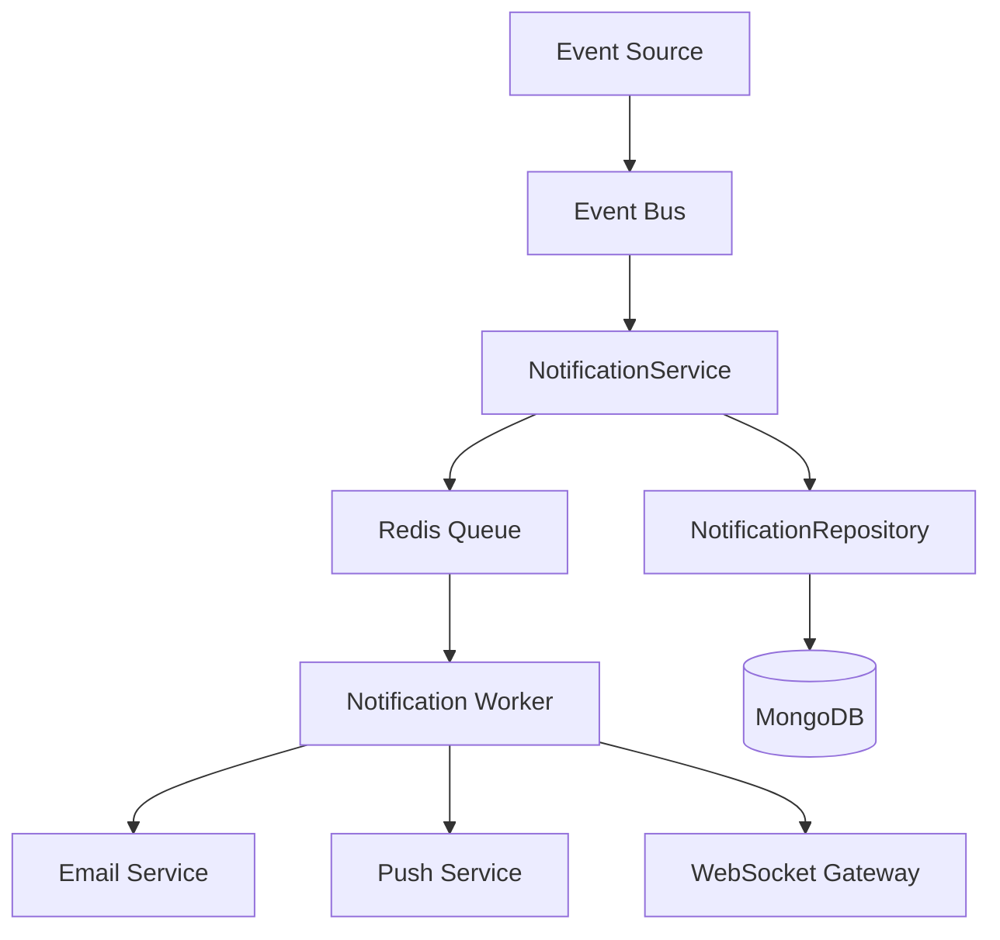
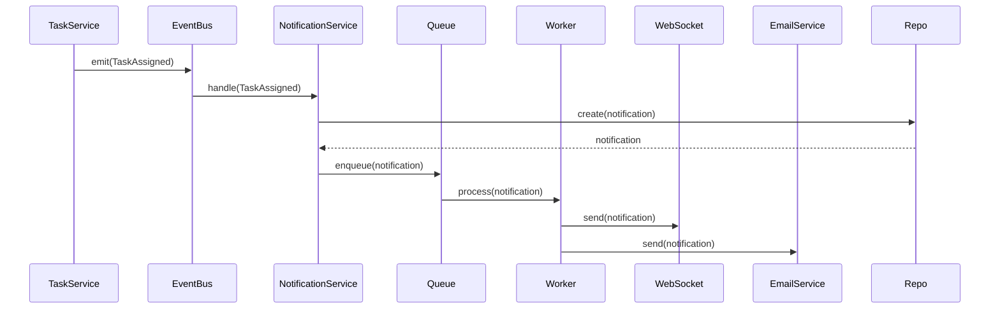

# Notification

---

## Business Problem

Why does this exist?

Users need immediate awareness when important events occur — task assignments, mentions, deadlines, comments — without constantly refreshing. Notifications must work across in-app, email, and push channels while respecting user preferences.

---

## Requirements

### Functional

- In-app notification list with read/unread status
- Email notifications with digest batching
- Push notifications (browser, mobile)
- Real-time delivery via WebSocket
- Per-user notification preferences
- Mark as read/unread
- Mark all as read
- Delete notifications

### Non-Functional

- Real-time delivery: <2 seconds
- Email delivery: <5 minutes
- Support 10k notifications/second
- 99.9% delivery reliability
- Graceful degradation if channels fail

---

## High Level Architecture



---

## Data Flow



---

## Database

### Collections

**notifications**
```javascript
{
  _id: ObjectId,
  userId: ObjectId,          // recipient, indexed
  type: String,              // 'TASK_ASSIGNED', 'MENTION', etc.
  title: String,
  body: String,
  metadata: {
    taskId: ObjectId,
    projectId: ObjectId,
    actorId: ObjectId
  },
  read: Boolean,
  readAt: Date,
  createdAt: Date
}
```

**notification_preferences**
```javascript
{
  _id: ObjectId,
  userId: ObjectId,          // indexed
  email: {
    enabled: Boolean,
    digest: String           // 'realtime', 'hourly', 'daily'
  },
  push: {
    enabled: Boolean
  },
  inApp: {
    enabled: Boolean
  },
  types: {
    TASK_ASSIGNED: { email: true, push: true },
    MENTION: { email: true, push: true },
    COMMENT_ADDED: { email: false, push: true }
  }
}
```

### Indexes

- `notifications.userId` — query by recipient
- `notifications.userId, notifications.read` — unread query
- `notifications.createdAt` — sorting

---

## API Design

### Endpoints

| Method | Path | Description |
|--------|------|-------------|
| GET | `/api/notifications` | List user notifications |
| GET | `/api/notifications/unread-count` | Get unread count |
| PATCH | `/api/notifications/:id/read` | Mark as read |
| PATCH | `/api/notifications/read-all` | Mark all as read |
| DELETE | `/api/notifications/:id` | Delete notification |
| GET | `/api/notifications/preferences` | Get preferences |
| PATCH | `/api/notifications/preferences` | Update preferences |

### DTOs

**NotificationResponse**
```typescript
{
  id: string;
  type: string;
  title: string;
  body: string;
  read: boolean;
  createdAt: string;
  metadata: Record<string, any>;
}
```

**PreferencesResponse**
```typescript
{
  email: { enabled: boolean; digest: string };
  push: { enabled: boolean };
  inApp: { enabled: boolean };
  types: Record<string, { email: boolean; push: boolean }>;
}
```

---

## Frontend

### Component Hierarchy

```
NotificationProvider
├── NotificationBell (badge with count)
├── NotificationDropdown
│   ├── NotificationList
│   │   └── NotificationItem
│   └── MarkAllReadButton
└── NotificationPreferencesModal
```

### State

```typescript
interface NotificationState {
  notifications: Notification[];
  unreadCount: number;
  loading: boolean;
}
```

### Cache

- Notifications list: React Query (1 min stale time)
- Unread count: Refetch every 30 seconds
- Real-time updates: WebSocket invalidates cache

---

## Backend

### Modules

```
notification/
├── notification.controller.ts
├── notification.service.ts
├── notification.worker.ts
├── notification.module.ts
├── email.service.ts
├── push.service.ts
├── websocket.gateway.ts
└── dto/
    ├── notification.dto.ts
    └── preferences.dto.ts
```

### Services

**NotificationService**
- `create(userId, type, data): Promise<Notification>`
- `findByUser(userId, query): Promise<Notification[]>`
- `markAsRead(id): Promise<void>`
- `markAllAsRead(userId): Promise<void>`

**EmailService**
- `sendNotificationEmail(notification): Promise<void>`
- `sendDigestEmail(userId, notifications): Promise<void>`

**PushService**
- `sendPushNotification(userId, notification): Promise<void>`

### Guards

Not applicable (notifications are per-user, JWT auth required)

### Events

- `TaskAssigned` → Notification
- `CommentAdded` → Notification
- `UserMentioned` → Notification
- `DeadlineApproaching` → Notification

---

## Security

### Threats

1. **Notification Spam** — Malicious user triggers mass notifications
2. **Data Leakage** — User sees another user's notifications
3. **XSS in Content** — Malicious content in notification body

### Mitigation

1. **Rate Limiting** — Max 100 notifications/user/hour
2. **Authorization** — Query filters by authenticated userId
3. **Sanitization** — HTML escape all user-generated content
4. **Validation** — Strict input validation on notification types

---

## Scaling

### 100 users

- Single worker process
- MongoDB M0
- Redis Cloud Free Tier
- Email: SendGrid free tier (100/day)
- Response time: <100ms

### 10k users

- 3 worker processes
- MongoDB M10
- Redis Cluster (2 nodes)
- Email: SendGrid Essentials ($20/month)
- WebSocket: 3 nodes (sticky sessions)
- Response time: <200ms

### 1M users

- 20+ worker processes (auto-scaled)
- MongoDB M40 (sharded)
- ElastiCache Redis (cluster mode)
- Email: SendGrid Pro ($90/month) + SES
- WebSocket: 50+ nodes (load balanced)
- Response time: <300ms

---

## Failure Scenarios

### Redis Queue Down

- **Impact**: No async processing, notifications delayed
- **Mitigation**:
  - Redis persistence (AOF + snapshot)
  - Circuit breaker: fallback to sync processing
  - Alert on-call engineer

### Email Service Down (SendGrid)

- **Impact**: Email notifications fail
- **Mitigation**:
  - Retry with exponential backoff (3 attempts)
  - Fallback to SES
  - Store failed emails in dead-letter queue
  - Alert on-call engineer

### WebSocket Disconnected

- **Impact**: User doesn't receive real-time updates
- **Mitigation**:
  - Auto-reconnect on frontend (exponential backoff)
  - Fetch missed notifications on reconnect
  - Show "reconnecting" indicator

---

## Monitoring

### Logs

```json
{
  "event": "notification_created",
  "notificationId": "123",
  "userId": "456",
  "type": "TASK_ASSIGNED",
  "timestamp": "2026-08-06T10:30:00Z"
}
```

```json
{
  "event": "email_failed",
  "notificationId": "123",
  "error": "SendGrid rate limit exceeded",
  "retryCount": 2
}
```

### Metrics

- `notification.created` — Counter (by type)
- `notification.delivered` — Counter (by channel)
- `notification.failed` — Counter (by channel, reason)
- `notification.delivery_time` — Histogram (p50, p95, p99)
- `notification.queue_size` — Gauge

### Tracing

- Span: `create_notification`
  - Child: `enqueue_job`
  - Child: `send_websocket`
  - Child: `send_email`

---

## Tradeoffs

### Alternative A: Poll-Based (No WebSocket)

**Pros**: Simple, no persistent connections  
**Cons**: Latency (poll every 30s), increased server load

### Alternative B: Server-Sent Events (SSE)

**Pros**: Simpler than WebSocket, one-way push  
**Cons**: No bidirectional communication, browser limits

### Why This One? (WebSocket)

**Pros**:
- True real-time delivery (<2s)
- Bidirectional (can send acknowledgments)
- Industry standard for real-time apps

**Cons**:
- Requires sticky sessions or shared state
- More complex infrastructure

**Decision**: Real-time UX is critical for collaboration platform.
